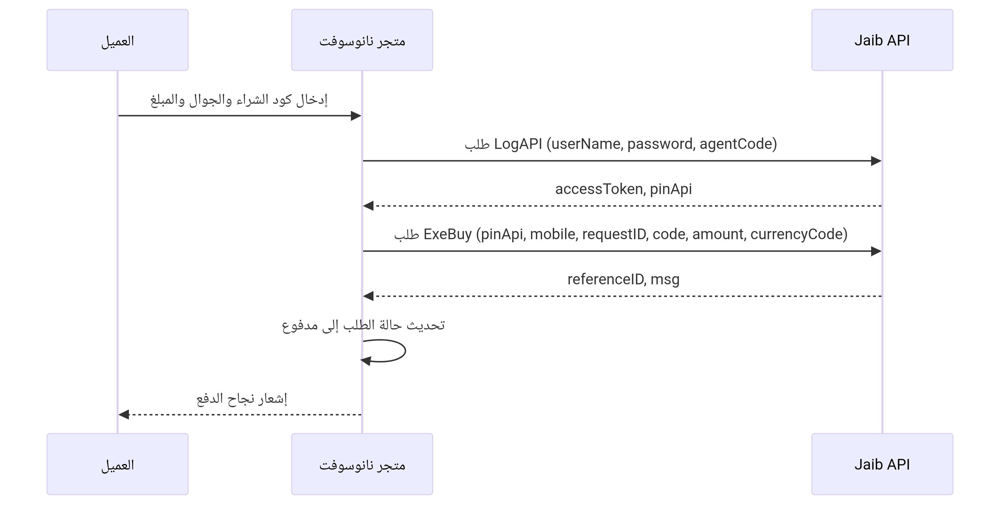

# توثيق بوابة الدفع JaibPay (محفظة جيب) – دليل المطور

## 1. نظرة عامة

**JaibPay** هي بوابة دفع إلكترونية مدمجة ضمن حزمة `Nano.Yepayment` في تطبيقات نانوسوفت. تعتمد البوابة على واجهة برمجة تطبيقات **Jaib Wallet API** وتستخدم آلية **الدفع الفوري (Direct Payment)** من خطوة واحدة:

1. **تنفيذ عملية شراء عبر الكود** (Execute Buy Online By Code) – يقوم العميل بإدخال كود الشراء الذي أنشأه مسبقاً في تطبيق جيب، ويتم خصم المبلغ فوراً من رصيده دون حاجة إلى تأكيد إضافي أو رمز OTP.

هذا الكلاس يمكن استخدامه مباشرة من خلال `Nano\Yepayment\PaymentTypes\JaibPay` أو عبر نظام المدفوعات الموحد `Nano\MicroCart\Classes\Payments\PaymentGateway`.

---

## 2. متطلبات التشغيل والإعدادات

### 2.1. المتطلبات الأساسية

- نظام نانوسوفت (Nano2Soft) الإصدار 2.0+
- إضافات مطلوبة:
  - `Nano.MicroCart` (>=2.0)
  - `Nano.Yepayment` (>=1.2)
  - `Nano.Helpers`
- بيانات الدخول إلى Jaib API (مقدمة من مشغل البوابة):
  - اسم المستخدم (`userName`)
  - كلمة المرور (`password`)
  - كود الوكيل (`agentCode` – القيمة الافتراضية `10004`)
  - رابط API الأساسي (مثال: `https://www.api2.e-jaib.com:5088`)

### 2.2. إعدادات البوابة في لوحة التحكم

عند تفعيل طريقة الدفع **"Jaib Pay (محفظة جيب)"**، تظهر الحقول التالية (تخزن في جدول `nano_microcart_payment_gateway_settings`):

| الحقل | المفتاح | الوصف |
|-------|---------|-------|
| رابط API الأساسي | `jaibpay_url` | عنوان API الخاص بـ Jaib (مثال: `https://www.api2.e-jaib.com:5088`) |
| رابط API للاختبار | `jaibpay_test_url` | (اختياري) عنوان بيئة الاختبار |
| اسم المستخدم | `jaibpay_username` | اسم مستخدم التاجر |
| كلمة المرور | `jaibpay_password` | كلمة مرور التاجر (تخزن مشفرة) |
| كود الوكيل (agentCode) | `jaibpay_agentcode` | رمز الوكيل المقدم من بوابة جيب (افتراضي `10004`) |
| العملة الافتراضية | `jaibpay_default_currency` | القيمة الافتراضية (YER, USD, SAR) |

يمكن الوصول إلى هذه الإعدادات داخل الكلاس عبر:
```php
$url = PaymentGatewaySettings::get('jaibpay_url', '');
$username = PaymentGatewaySettings::get('jaibpay_username', '');
$agentCode = PaymentGatewaySettings::get('jaibpay_agentcode', '10004');
```

---

## 3. كلاس JaibPay – الطرق الأساسية

### 3.1. تعريف الكلاس

```php
namespace Nano\Yepayment\PaymentTypes;

use Nano\MicroCart\Classes\Payments\PaymentProvider;
use Nano\MicroCart\Classes\Payments\PaymentResult;
use Nano\MicroCart\Models\PaymentGatewaySettings;

class JaibPay extends PaymentProvider
{
    // ...
}
```

### 3.2. الخصائص الأساسية

| الخاصية | النوع | الوصف |
|----------|------|-------|
| `$order` | `Order` | كائن الطلب المرتبط بالدفع |
| `$data` | `array` | البيانات الواردة من المستخدم (كود الشراء، الجوال، المبلغ، إلخ) |
| `$success_url` | `string` | (غير مستخدم في JaibPay لأن الدفع مباشر بدون redirect) |
| `$cancel_url` | `string` | (غير مستخدم) |

### 3.3. الطرق الرئيسية

#### `public function identifier(): string`
يعيد معرف فريد لطريقة الدفع (`jaibpay`).

#### `public function name(): string`
يعيد الاسم المعروض (`Jaib Pay (محفظة جيب)`).

#### `public function process(PaymentResult $result): PaymentResult`
ينشئ دفعة جديدة (تنفيذ الدفع المباشر) عبر API.

**المدخلات المتوقعة في `$this->data` (من نموذج الدفع):**
- `purchase_code` – كود الشراء (مطلوب)
- `mobile` – رقم جوال العميل (مطلوب)
- `amount` – المبلغ (مطلوب)
- `currency` – العملة (اختياري، يستخدم الافتراضي إن لم يوجد)
- `notes` – ملاحظة (اختياري)

**الإجراءات:**
1. التحقق من صحة البيانات عبر `defineValidationRules()`.
2. الحصول على `accessToken` و `pinApi` عبر `getAuthToken()` (من Cache أو API).
3. توليد `requestID` فريد (UUID).
4. إرسال طلب POST إلى `/api/v1/BuyOnline/ExeBuy` مع البيانات.
5. إذا نجحت العملية، حفظ `requestID` في `order->payment_first_trans_id` و `referenceID` في `order->payment_trans_id`.
6. حفظ بيانات إضافية في `order->other_data['jaibpay']`.
7. تحديث حالة الطلب إلى `PaidState` عبر `$result->success()`.
8. إرجاع `PaymentResult` بنجاح.

#### `public function complete(PaymentResult $result): PaymentResult`
غير مستخدم في هذا النوع (الدفع الفوري). يترك فارغاً أو يمكن استخدامه لاسترجاع الأموال مستقبلاً.

#### `private function getAuthToken(): ?array`
يطلب `accessToken` و `pinApi` من Jaib API.

**نقطة النهاية:** `POST /api/v1/TokenAuth/LogAPI`  
**البيانات:** `{"userName": "...", "password": "...", "agentCode": "..."}`  
**الإرجاع:** مصفوفة تحتوي على `accessToken`, `pinApi`, `expire` أو `null` في حال الفشل.  
**التخزين المؤقت:** يتم تخزينها في Cache لمدة 86000 ثانية.

#### `private function executeBuy(string $accessToken, string $pinApi, string $requestID): array`
ينفذ عملية الشراء عبر الكود.

**نقطة النهاية:** `POST /api/v1/BuyOnline/ExeBuy`  
**البيانات:** `{"pinApi": "...", "mobile": "...", "requestID": "...", "code": "...", "amount": ..., "currencyCode": "...", "notes": "..."}`  
**الإرجاع:** مصفوفة تحتوي على `success`, `referenceID`, `requestID`, `msg`, `amount`, `currencyCode`.

#### `public function checkTransactionStatus(string $requestID): array`
يستعلم عن حالة معاملة باستخدام `requestID`.

**نقطة النهاية:** `POST /api/v1/BuyOnline/CheckProgress`  
**البيانات:** `{"pinApi": "...", "requestID": "..."}`  
**الإرجاع:** مصفوفة تحتوي على `success`, `request_id`, `reference_id`, `raw_response`.

#### `private function getApiUrl(string $type): string`
يبني روابط API بناءً على النوع (`login`, `buy`, `refund`, `check`).

#### `private function parseResponse($response): array`
يحول استجابة Guzzle إلى مصفوفة PHP.

---

## 4. آلية الدفع خطوة بخطوة (للمطور)

### 4.1. تدفق العملية الكامل



### 4.2. دمج البوابة في واجهة برمجة تطبيقات (API) مخصصة

#### أ. تنفيذ دفعة جديدة (بدء الدفع)

**نقطة نهاية مخصصة في `routes/api.php`:**

```php
Route::post('/payment/jaibpay/create', function (Request $request) {
    $order = Order::find($request->order_id);
    $jaib = new JaibPay($order, [
        'purchase_code' => $request->purchase_code,
        'mobile'        => $request->mobile,
        'amount'        => $request->amount,
        'currency'      => $request->currency ?? 'YER',
        'notes'         => $request->notes,
    ]);
    $result = new PaymentResult($jaib, $order);
    $processResult = $jaib->process($result);
    return response()->json([
        'success'      => $processResult->successful,
        'request_id'   => $order->payment_first_trans_id,
        'reference_id' => $order->payment_trans_id,
        'message'      => $processResult->message,
    ]);
});
```

**طلب مثال:**
```json
POST /api/payment/jaibpay/create
{
    "order_id": 200,
    "purchase_code": "3719",
    "mobile": "774760761",
    "amount": 5000,
    "currency": "YER",
    "notes": "دفع الطلب #200"
}
```

**استجابة:**
```json
{
    "success": true,
    "request_id": "550e8400-e29b-41d4-a716-446655440000",
    "reference_id": "16986110064345",
    "message": "تمت عملية الدفع بنجاح"
}
```

#### ب. الاستعلام عن حالة المعاملة

```php
Route::get('/payment/jaibpay/status', function (Request $request) {
    $jaib = new JaibPay();
    $status = $jaib->checkTransactionStatus($request->request_id);
    return response()->json($status);
});
```

**طلب:**
```
GET /api/payment/jaibpay/status?request_id=550e8400-e29b-41d4-a716-446655440000
```

**استجابة:**
```json
{
    "success": true,
    "request_id": "550e8400-e29b-41d4-a716-446655440000",
    "reference_id": "16986110064345",
    "raw_response": { ... }
}
```

---

## 5. نقاط نهاية الاختبار المضمنة في `routes.php`

ضمن ملف `routes.php` الخاص بـ `Nano.Yepayment`، تم توفير مجموعة من نقاط النهاية المساعدة تحت المجموعة `/api/v1/yepayment`، والمخصصة للمطورين والمسؤولين لاختبار البوابة.

### 5.1. قائمة نقاط النهاية

| المسار | الطريقة | الوصف |
|--------|---------|-------|
| `/jaibpay/test-auth` | POST | اختبار المصادقة مع Jaib API (الحصول على accessToken و pinApi) |
| `/jaibpay/test-create-payment` | POST | إنشاء دفعة جديدة (تنفيذ الدفع المباشر) |
| `/jaibpay/test-check-status` | GET | الاستعلام عن حالة معاملة باستخدام `request_id` |
| `/jaibpay/test-full-payment` | POST | اختبار شامل (إنشاء دفعة + استعلام) |
| `/jaibpay/stats` | GET | إحصائيات استخدام البوابة (عدد الطلبات، نسبة النجاح) |
| `/jaibpay/test-ui` | GET | واجهة ويب تفاعلية لاختبار جميع الوظائف |

### 5.2. شرح كل نقطة نهاية

#### `POST /jaibpay/test-auth`
لا تحتاج إلى بيانات إدخال (تستخدم الإعدادات المخزنة).  
**الاستجابة:** `{ success, data: { access_token_length, pin_api, expire } }`

#### `POST /jaibpay/test-create-payment`
**بيانات الطلب (JSON):**
```json
{
    "order_id": 200,
    "purchase_code": "3719",
    "mobile": "774760761",
    "amount": 5000,
    "currency": "YER",
    "notes": "اختبار"
}
```
**الاستجابة:** `{ success, data: { request_id, reference_id, api_data }, order_data }`

#### `GET /jaibpay/test-check-status?request_id=...`
**الاستجابة:** `{ success, request_id, reference_id, raw_response }`

#### `POST /jaibpay/test-full-payment`
يقوم بتنفيذ خطوتين تلقائياً (إنشاء دفعة + استعلام).  
**الاستجابة:** تحتوي على `results` (نتائج كل خطوة) و `summary`.

#### `GET /jaibpay/test-ui`
يعرض واجهة HTML متكاملة تحتوي على:
- اختبار يدوي خطوة بخطوة (إنشاء دفعة، استعلام، اختبار شامل)
- اختبار تلقائي بعدد مرات قابل للتحديد (1-10 مرات)
- إحصائيات فورية (عدد الطلبات، نسبة النجاح، آخر السجلات)
- سجلات الاختبارات المخزنة في LocalStorage
- أدوات إضافية (اختبار الاتصال، تصدير السجلات، إعادة التعيين)

#### `GET /jaibpay/stats`
**الاستجابة:** إحصائيات مثل `total_orders`, `jaibpay_orders`, `successful_payments`, `success_rate`, إعدادات البوابة.

---

## 6. التعامل مع البوابة عبر API خارجي (للتطبيقات الأخرى)

إذا كنت تطور تطبيقاً خارجياً (مثلاً تطبيق جوال أو متجر إلكتروني مستقل) وترغب في دمج JaibPay دون استخدام كلاس `JaibPay` مباشرة، يمكنك الاتصال بـ **نقاط النهاية العامة** التي يوفرها النظام (المذكورة أعلاه) بعد المصادقة عبر `oauth-users`.

### 6.1. المصادقة المسبقة

يجب أن يكون لديك توكن OAuth 2.0 صالح (يمكن الحصول عليه من نظام نانوسوفت عبر نقطة نهاية تسجيل الدخول المعتادة). ثم ترسل التوكن في الهيدر:
```
Authorization: Bearer <token>
```

### 6.2. مثال متكامل باستخدام cURL

#### أ. إنشاء دفعة جديدة
```bash
curl -X POST "https://yourdomain.com/api/v1/yepayment/jaibpay/test-create-payment" \
  -H "Authorization: Bearer <token>" \
  -H "Content-Type: application/json" \
  -d '{
    "order_id": 200,
    "purchase_code": "3719",
    "mobile": "774760761",
    "amount": 5000,
    "currency": "YER",
    "notes": "شراء منتج"
  }'
```

#### ب. الاستعلام عن حالة الدفعة
```bash
curl -X GET "https://yourdomain.com/api/v1/yepayment/jaibpay/test-check-status?request_id=550e8400-e29b-41d4-a716-446655440000" \
  -H "Authorization: Bearer <token>"
```

> **ملاحظة:** نقاط النهاية هذه محمية بـ `BackendAuth` أيضاً (تتطلب أن يكون المستخدم مسؤولاً). إذا كنت تريد توفيرها للعملاء العاديين، يجب تعديل `routes.php` لإزالة فحص `BackendAuth` أو إضافة middleware مخصص.

---

## 7. رموز الأخطاء الشائعة والحلول

| كود HTTP | الخطأ (من Jaib API) | السبب والحل |
|----------|----------------------|--------------|
| 401 | Unauthorized | فشل المصادقة – تحقق من `userName`/`password`/`agentCode` في الإعدادات. |
| 400 | "رقم الكود غير صحيح" (code 51) | كود الشراء غير صحيح أو منتهي الصلاحية – تأكد من الكود المدخل. |
| 400 | "قد تم استخدام الكود مسبقا" (code -1026) | تم استهلاك الكود مسبقاً – استخدم كود جديد. |
| 400 | "رصيد غير كاف" | رصيد العميل في محفظة جيب لا يكفي للمبلغ المطلوب. |
| 400 | "المعاملة غير موجودة" | `requestID` غير صحيح – تحقق من المعرف المخزن. |
| 500 | Internal Server Error | مشكلة في الاتصال بـ Jaib API – تأكد من الرابط، أو حاول لاحقاً. |

---

## 8. أمثلة عملية لاستخدام الكلاس في كود مخصص

### 8.1. إنشاء دفعة جديدة بدون استخدام `PaymentGateway`

```php
use Nano\Yepayment\PaymentTypes\JaibPay;
use Nano\Orders\Models\Order;

$order = Order::find(200);
$jaib = new JaibPay($order, [
    'purchase_code' => '3719',
    'mobile'        => '774760761',
    'amount'        => 5000,
    'currency'      => 'YER',
    'notes'         => 'دفع الطلب #200',
]);

$paymentResult = new \Nano\MicroCart\Classes\Payments\PaymentResult($jaib, $order);
$processResult = $jaib->process($paymentResult);

if ($processResult->successful) {
    $requestID = $order->payment_first_trans_id;
    $referenceID = $order->payment_trans_id;
    // توجيه المستخدم إلى صفحة النجاح
}
```

### 8.2. الاستعلام عن حالة دفعة

```php
$jaib = new JaibPay();
$status = $jaib->checkTransactionStatus('550e8400-e29b-41d4-a716-446655440000');
if ($status['success']) {
    echo "Reference ID: " . $status['reference_id'];
}
```

### 8.3. استخدام دالة المصادقة للحصول على التوكن فقط

```php
$jaib = new JaibPay();
$auth = $jaib->getAuthToken(); // يعيد مصفوفة تحتوي على accessToken, pinApi
if ($auth) {
    echo "Token: " . $auth['accessToken'];
}
```

---

## 9. ملخص نقاط النهاية في `routes.php` (مرجع سريع)

| المسار الكامل | الطريقة | الاستخدام |
|---------------|---------|-----------|
| `/api/v1/yepayment/jaibpay/test-auth` | POST | اختبار بيانات الدخول |
| `/api/v1/yepayment/jaibpay/test-create-payment` | POST | إنشاء دفعة جديدة |
| `/api/v1/yepayment/jaibpay/test-check-status` | GET | الاستعلام عن حالة معاملة |
| `/api/v1/yepayment/jaibpay/test-full-payment` | POST | اختبار شامل (إنشاء + استعلام) |
| `/api/v1/yepayment/jaibpay/stats` | GET | إحصائيات البوابة |
| `/api/v1/yepayment/jaibpay/test-ui` | GET | واجهة اختبار ويب |

> **ملاحظة:** جميع هذه النقاط تتطلب أن يكون المستخدم الحالي مديراً (`BackendAuth`). لإتاحتها لعملاء API عاديين، قم بتعديل `routes.php` أو أضف middleware مخصص.

---

## 10. المراجع

- [كلاس JaibPay.php](./JaibPay.php) – الكود الكامل للبوابة.
- [ملف routes.php](./routes.php) – تعريف نقاط النهاية الخاصة بـ JaibPay.
- [وثيقة API الخاصة بـ Jaib Pay – تسجيل الدخول (Login.pdf)](./Login.pdf)
- [وثيقة API الخاصة بـ Jaib Pay – تنفيذ واستعلام الدفع (Jaib Wallet Pay API.pdf)](./Jaib%20Wallet%20Pay%20API.pdf)
- [مجموعة Postman لاختبار API Jaib Pay](./Jaib%20Pay%20API.postman_collection.json)

---

**تم إعداد هذا التوثيق لمساعدة المطورين على دمج واستخدام بوابة JaibPay (محفظة جيب) بسهولة وفعالية.**  
للاستفسارات أو الدعم الفني، يرجى التواصل عبر الموقع الرسمي [nano2soft.com](https://nano2soft.com).