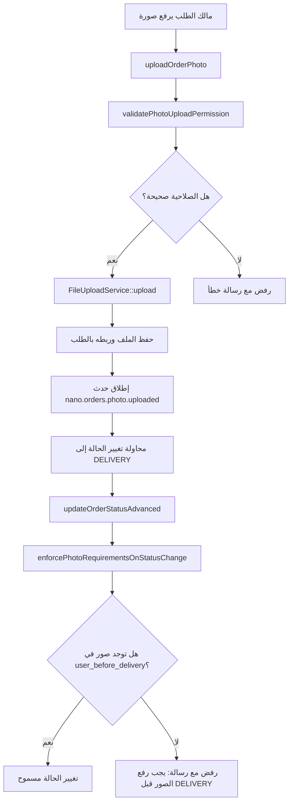

# التوثيق المتقدم لسمة `StepPhotos` – شرح آلية العمل خطوة بخطوة

**Namespace:** `Nano\Orders\Traits\Steps`  
**الإضافة:** `Nano.Orders`  
**الإصدار:** 2.2.12  

---

## 📋 مقدمة

يقدم هذا المستند شرحاً تفصيلياً لآلية عمل سمة `StepPhotos`، مع التركيز على **التسلسل المنطقي** للدوال الرئيسية، وتفاعلها مع `Nano.FileUpload`، ومعالجة الأخطاء، واستراتيجيات التخزين المؤقت، والتحقق من الصلاحية متعدد المستويات. يُوصى بقراءة التوثيق الأساسي للسمة أولاً قبل الغوص في هذا المستند المتقدم.

---

## 🔹 الخطوة 1: تهيئة القواعد والتخزين المؤقت

### `getDefaultPhotoUploadRules()`

عند أول استدعاء لأي دالة تحتاج إلى قواعد الصور، يتم استدعاء هذه الدالة. تمر بالمراحل التالية:

1. **التحقق من الكاش** – تفحص `self::$cachedPhotoRules`. إذا كانت القيمة موجودة، تُرجعها فوراً لتجنب إعادة بناء المصفوفة.
2. **بناء القواعد الافتراضية** – تُنشئ مصفوفة `$rules` تحتوي على الإعدادات الافتراضية للحقول الأربعة:
   - `user_before_delivery`
   - `user_after_delivery`
   - `delivery_before_delivery`
   - `delivery_after_delivery`
3. **دمج الإعدادات من `config`** – تقرأ `Config::get('nano.orders::photo_rules', [])` وتدمجها مع القواعد الافتراضية باستخدام `array_replace_recursive` (دون فقدان المفاتيح غير الموجودة في config).
4. **تخزين النتيجة في الكاش** – تضع المصفوفة النهائية في `self::$cachedPhotoRules` لاستخدامها في الاستدعاءات اللاحقة.
5. **الإرجاع** – تعيد المصفوفة الكاملة.

**لماذا التخزين المؤقت؟**
- يتم استدعاء هذه الدالة عدة مرات في كل طلب (في `validatePhotoUploadPermission`، `uploadOrderPhoto`، `enforcePhotoRequirementsOnStatusChange`). التخزين المؤقت يمنع إعادة بناء القواعد مئات المرات.

---

## 🔹 الخطوة 2: رفع صورة واحدة (`uploadOrderPhoto`)

تعتبر هذه الدالة **نقطة الدخول الرئيسية** لرفع الصور. تمر بمراحل متسلسلة لضمان الأمان والتكامل مع `Nano.FileUpload`.

### المرحلة 2.1: التحقق من وجود الطلب

```php
$order = $options['order'] ?? $this->getOrderModel();
if (!$order || !$order->exists) {
    throw new ApplicationException(trans('nano.orders::lang.manager.photo.order_not_found'));
}
```
- إذا لم يُمرر `order` في الخيارات، تُستخدم `$this->getOrderModel()` (من `OrderManager`).
- يتم التحقق من وجود الطلب ووجوده في قاعدة البيانات (`exists`).

### المرحلة 2.2: التحقق من صحة اسم الحقل

```php
$allowedFields = ['user_before_delivery', 'user_after_delivery', 'delivery_before_delivery', 'delivery_after_delivery'];
if (!in_array($field, $allowedFields)) {
    throw new ApplicationException('Invalid field name.');
}
```
- **لماذا هذا الفحص؟**  
  يمنع المستخدم الضار من تمرير `field = 'image'` أو `field = 'files'` (علاقات أخرى في `Order`) وتجاوز القيود الموضوعة للحقول المخصصة للصور.

### المرحلة 2.3: استخراج بيانات الملف

```php
if (!$fileData && Input::hasFile($field)) {
    $fileData = Input::file($field);
}
if (!$fileData) {
    throw new ApplicationException(trans('nano.orders::lang.manager.photo.file_required'));
}
```
- يدعم الدالة مصدرين للملفات:
  1. **تمرير مباشر** (كائن `UploadedFile` أو نص `base64`).
  2. **استخراج من `Input::file()`** (لطلبات `multipart/form-data`).
- إذا لم يتم العثور على ملف في أي من المصدرين، يتم رمي استثناء.

### المرحلة 2.4: تحديد الفاعل والتحقق من الصلاحية

```php
$actor = $options['user'] ?? $this->resolveActor();
$skipPermission = $options['skip_permission'] ?? false;

if (!$skipPermission) {
    $this->validatePhotoUploadPermission($field, $actor, $order, null, $options);
}
```
- يستخدم `resolveActor()` لتحديد المستخدم الحالي (نفس منطق `updateOrderStatusAdvanced`).
- إذا كان `skip_permission = true`، يتم تجاوز فحص الصلاحية (يُستخدم للاختبارات أو للمسؤولين في سيناريوهات خاصة).

### المرحلة 2.5: تحضير خيارات الرفع لـ `FileUploadService`

```php
$uploadOptions = [
    'model' => $order,
    'title' => $options['title'] ?? $field,
    'description' => $options['description'] ?? null,
    'is_public' => $options['is_public'] ?? false,
    'field' => $field,
    'auto_resize' => $options['auto_resize'] ?? false,
    'resize_options' => $options['resize_options'] ?? [],
    'auto_watermark' => $options['auto_watermark'] ?? false,
    'watermark_options' => $options['watermark_options'] ?? [],
];
```
- يتم تمرير خيارات إضافية مثل `auto_resize` و `auto_watermark` لدعم معالجة الصور تلقائياً (تحجيم، علامة مائية).

### المرحلة 2.6: استدعاء خدمة رفع الملفات

```php
$uploadResult = FileUploadService::instance()->upload(
    get_class($order),
    $field,
    $fileData,
    $uploadOptions
);
```
- `FileUploadService` يتولى:
  - التحقق من إعدادات الحقل المسجلة في `FileUploadRegistry` (الحد الأقصى للحجم، الأنواع المسموحة).
  - حفظ الملف على القرص المحدد (محلي، S3، إلخ).
  - إنشاء سجل في جدول `system_files` مع `hash` و `meta` و `session_key`.
  - ربط الملف بالطلب عبر `attachment_type` و `attachment_id` (إذا مررنا `model`).

### المرحلة 2.7: معالجة النتيجة واستخراج كائن الملف

```php
$newFile = $uploadResult['model'] ?? null;
if (!$newFile && isset($uploadResult['data']['id'])) {
    $newFile = \System\Models\File::find($uploadResult['data']['id']);
}
```
- `FileUploadService::upload` تعيد `model` في المصفوفة (في الإصدارات الحديثة)، لكن كإجراء احترازي، إذا لم نجده، نحاول البحث عن الملف باستخدام `id` من `data`.

### المرحلة 2.8: إطلاق حدث `nano.orders.photo.uploaded`

```php
if ($newFile) {
    Event::fire('nano.orders.photo.uploaded', [
        'order' => $order,
        'field' => $field,
        'file' => $newFile,
        'actor' => $actor,
    ]);
}
```
- يمكن للمطورين الاستماع لهذا الحدث لإرسال إشعارات WebSocket، أو تسجيل النشاط، أو تحديث إحصائيات.

### المرحلة 2.9: إرجاع الاستجابة

```php
$result['data'] = $uploadResult['data'];
$result['process_data'] = $uploadResult['process_data'];
$result['message'] = $options['custom_message'] ?? $result['message'];
```

---

## 🔹 الخطوة 3: التحقق من الصلاحية (`validatePhotoUploadPermission`)

هذه الدالة هي **قلب نظام الصلاحية** في السمة. تعمل بالترتيب التالي:

### المرحلة 3.1: جلب القواعد المناسبة

```php
$rules = $options['rules'] ?? $this->getDefaultPhotoUploadRules();
$fieldRules = $rules[$field] ?? null;

if (!$fieldRules) {
    return; // لا توجد قواعد محددة للحقل → نسمح (يمكن رفعه في أي وقت)
}
```
- إذا كانت القواعد فارغة، يتم السماح بالرفع (سلوك آمن: عدم وجود قيود يعني عدم منع).

### المرحلة 3.2: تحديد دور المستخدم

```php
$role = $this->getUserRoleForOrder($user, $order);
if (!$role && !($user instanceof \Backend\Models\User)) {
    throw new ApplicationException(trans('nano.orders::lang.manager.photo.no_permission'));
}
```
- `getUserRoleForOrder` تعيد `'user'` أو `'delivery'` أو `'admin'` أو `null`.
- المستخدم غير المرتبط بالطلب وليس مديراً → رفض.

### المرحلة 3.3: التحقق من الدور المسموح

```php
$allowedRoles = $options['allowed_roles'] ?? ($fieldRules['allowed_roles'] ?? []);
if (!in_array($role, $allowedRoles) && $role !== 'admin') {
    throw new ApplicationException(trans('nano.orders::lang.manager.photo.role_not_allowed', [
        'role' => $role,
        'field' => $field,
    ]));
}
```
- المدير (`admin`) مسموح دائماً (لا حاجة لإدراجه في `allowed_roles`).

### المرحلة 3.4: التحقق من الحالة المسموحة للرفع

```php
$allowedStatuses = $options['allowed_statuses'] ?? ($fieldRules['allowed_statuses'] ?? []);
if (!empty($allowedStatuses) && !in_array($order->order_states_ref_type, $allowedStatuses)) {
    throw new ApplicationException(trans('nano.orders::lang.manager.photo.status_not_allowed', [
        'status' => $order->order_states_ref_type,
        'field' => $field,
    ]));
}
```
- إذا كانت القائمة فارغة، لا يتم تطبيق القيد (يسمح بالرفع في أي حالة).

### المرحلة 3.5: التحقق من الحد الأقصى لعدد الصور

```php
if (($fieldRules['max_files'] ?? 0) > 0 && $order->{$field}()->count() >= $fieldRules['max_files']) {
    throw new ApplicationException(trans('nano.orders::lang.manager.photo.max_files_reached', [
        'max' => $fieldRules['max_files'],
        'field' => $field,
    ]));
}
```
- يستخدم `count()` للعلاقات من نوع `attachMany`. إذا كان الحقل فردياً (`attachOne`)، فلن يتم تطبيق هذا الفحص (يتم التحكم عبر `max_files = 1`).

### المرحلة 3.6: التحقق من متطلبات الحالة الجديدة (اختياري)

```php
if ($newStatus) {
    $requiredOnTransition = $options['required_on_transition'] ?? ($fieldRules['required_on_transition'] ?? []);
    if (in_array($newStatus, $requiredOnTransition)) {
        $count = $order->{$field}()->count();
        if ($count == 0) {
            throw new ApplicationException(trans('nano.orders::lang.manager.photo.required_before_transition', [
                'field' => $field,
                'status' => $newStatus,
            ]));
        }
    }
}
```
- هذا الفحص يُستخدم عندما نحاول تغيير حالة الطلب (`updateOrderStatusAdvanced`) ونتحقق مما إذا كانت الصور المطلوبة موجودة قبل الانتقال.

---

## 🔹 الخطوة 4: رفع عدة صور (`uploadOrderPhotos`)

هذه الدالة تُعد **حلقة تكرارية آمنة** لرفع مجموعة من الصور.

### المرحلة 4.1: معالجة المدخلات

```php
if ((!$filesData || empty($filesData)) && Input::hasFile($field)) {
    $filesData = Input::file($field);
}

if (!empty($filesData) && !is_array($filesData)) {
    $filesData = [$filesData];
}

if (!$filesData || !is_array($filesData)) {
    throw new ApplicationException(trans('nano.orders::lang.manager.photo.files_array_required'));
}
```
- إذا لم تُمرر مصفوفة الملفات، نحاول جلبها من `Input::file($field)` (والتي قد تعيد مصفوفة إذا كان الحقل `multiple` في HTML).
- إذا كانت القيمة مفردة (غير مصفوفة)، نحولها إلى مصفوفة.
- إذا بقيت فارغة أو ليست مصفوفة، نرفض.

### المرحلة 4.2: فحص الصلاحية مرة واحدة فقط

```php
if (!$skipPermission) {
    $this->validatePhotoUploadPermission($field, $actor, $order, null, $options);
}
```
- نتحقق من صلاحية المستخدم لرفع الصور في هذا الحقل **مرة واحدة فقط** قبل التكرار، بدلاً من التحقق لكل ملف (تحسين الأداء).

### المرحلة 4.3: التكرار على الملفات

```php
foreach ($filesData as $index => $fileData) {
    $singleResult = $this->uploadOrderPhoto($field, $fileData, array_merge($options, ['skip_permission' => true]));
    // ...
}
```
- نمرر `skip_permission = true` لكل استدعاء فردي لأننا فحصنا الصلاحية مسبقاً.
- نجمع النتائج وعدد النجاحات والأخطاء.

### المرحلة 4.4: تحديد كود الاستجابة النهائي

```php
$result['code'] = $successCount === count($filesData) ? 200 : 207; // 207 Partial Content
```
- `200` (جميع الملفات نجحت).
- `207` (نجح بعضها وفشل بعضها الآخر).

---

## 🔹 الخطوة 5: حذف الصورة (`deleteOrderPhoto`)

عملية الحذف أسهل، لكنها تتضمن أيضاً التحقق من الصلاحية.

### المرحلة 5.1: التحقق من وجود الملف

```php
$file = $order->{$field}()->find($fileId);
if (!$file) {
    throw new ApplicationException(trans('nano.orders::lang.manager.photo.file_not_found'));
}
```
- نبحث عن الملف في علاقة الحقل. إذا لم نجده (قد يكون حُذف مسبقاً أو معرف غير صحيح)، نرفض.

### المرحلة 5.2: التحقق من الصلاحية للحذف

```php
if (!$skipPermission) {
    $this->validatePhotoUploadPermission($field, $actor, $order, null, $options);
}
```
- نستخدم نفس دالة التحقق من الصلاحية (`validatePhotoUploadPermission`) مع `$newStatus = null` (لا نتحقق من متطلبات الحالة الجديدة، بل فقط من صلاحية المستخدم للحقل بشكل عام).

### المرحلة 5.3: حذف الملف وإطلاق الحدث

```php
$file->delete();
Event::fire('nano.orders.photo.deleted', [
    'order' => $order,
    'field' => $field,
    'file_id' => $fileId,
    'actor' => $actor,
]);
```
- `$file->delete()` يحذف السجل من جدول `system_files` ويحذف الملف الفعلي من القرص (إذا كان التخزين يدعم ذلك، مثل `local` و `s3` مع إعدادات الحذف).
- يتم إطلاق الحدث بعد الحذف الناجح.

---

## 🔹 الخطوة 6: دمج `enforcePhotoRequirementsOnStatusChange` مع `updateOrderStatusAdvanced`

هذه الدالة تُستدعى **تلقائياً** من `updateOrderStatusAdvanced` قبل تطبيق تغيير الحالة.

### كيفية التكامل:

```php
// داخل updateOrderStatusAdvanced
if (!$skipPhotoCheck && method_exists($this, 'enforcePhotoRequirementsOnStatusChange')) {
    $effectiveNewStatus = $newOrderState;
    if (!$effectiveNewStatus && ($newUserStatus === $newDeliveryStatus && $newUserStatus)) {
        $effectiveNewStatus = $newUserStatus;
    } elseif (!$effectiveNewStatus && $newUserStatus) {
        $effectiveNewStatus = $newUserStatus;
    } elseif (!$effectiveNewStatus && $newDeliveryStatus) {
        $effectiveNewStatus = $newDeliveryStatus;
    }

    if ($effectiveNewStatus && $effectiveNewStatus !== $order->order_states_ref_type) {
        $photoOptions = [];
        if ($photoValidationRules) {
            $photoOptions['rules'] = $photoValidationRules;
        }
        $this->enforcePhotoRequirementsOnStatusChange(
            $order->order_states_ref_type,
            $effectiveNewStatus,
            $order,
            $actor,
            $photoOptions
        );
    }
}
```

**شرح المنطق:**
1. إذا كان `skip_photo_check = true`، نتجاوز الفحص بالكامل.
2. نحدد الحالة الجديدة الفعلية:
   - أولوية لـ `order_states_ref_type` (إذا تم تمريره).
   - إذا لم يُمرر، نستخدم `user_status` أو `delivery_status` (أيهما موجود وغير فارغ).
   - إذا تساوت `user_status` و `delivery_status` (كلاهما `CANCELLED` مثلاً)، نستخدمها كحالة رئيسية.
3. إذا كانت الحالة الجديدة مختلفة عن الحالة الحالية، نستدعي `enforcePhotoRequirementsOnStatusChange`.
4. نمرر القواعد المخصصة (`photo_validation_rules`) إذا وُجدت.

---

## 🔹 الخطوة 7: جلب روابط الصور (`getOrderPhotoUrls`)

هذه الدالة تُستخدم بشكل أساسي في **واجهات API** لعرض الصور بشكل مناسب.

### المرحلة 7.1: جلب الملفات من العلاقة

```php
$files = $order->{$field};
if (!$files) {
    return null;
}
```
- إذا كان الحقل من نوع `attachMany`، يعيد `Collection` من الملفات.
- إذا كان من نوع `attachOne`، يعيد كائن ملف واحد أو `null`.

### المرحلة 7.2: تنسيق كل ملف

```php
if ($files instanceof \Illuminate\Database\Eloquent\Collection) {
    return $files->map(function($file) use ($thumbSizes, $includeModel) {
        return $this->formatPhotoFile($file, $thumbSizes, $includeModel);
    })->toArray();
}
```
- `formatPhotoFile` تقوم بـ:
  1. جمع البيانات الأساسية (`id`, `title`, `description`, `path`, `size`, `content_type`, `created_at`).
  2. توليد صور مصغرة (إذا تم تمرير `$thumbSizes`).
  3. تضمين كائن الملف إذا `$includeModel = true` (للاستخدام المتقدم).

---

## 🔹 معالجة الأخطاء والاستثناءات

### استراتيجية الاستثناءات

| المستوى | الإجراء |
|----------|---------|
| **مدخلات غير صالحة** (`Invalid field name`, `الملف مطلوب`) | يرمي `ApplicationException` برسالة واضحة. |
| **صلاحية مرفوضة** (`role_not_allowed`, `status_not_allowed`, `max_files_reached`) | يرمي `ApplicationException` مع رسالة مترجمة. |
| **فشل خدمة رفع الملفات** (`FileUploadService::upload` يعيد `status = false`) | يلتقط الاستثناء ويعيد `code = 400` مع رسالة الخطأ الأصلي. |
| **أخطاء غير متوقعة** (مشكلة في قاعدة البيانات، انقطاع الاتصال) | يلتقطها الكتلة `catch (Exception $e)` ويعيد `code = 400` مع تفاصيل في وضع التصحيح. |

### تسجيل الأخطاء (Debug)

```php
if (Config::get('app.debug')) {
    $result['debug'] = [
        'line' => $e->getLine(),
        'file' => $e->getFile(),
        'trace' => explode("\n", $e->getTraceAsString()),
    ];
}
```
- في بيئة التطوير، تضاف تفاصيل التتبع (مسار الملف، رقم السطر، المكدس) لمساعدة المطورين.

---

## 🔹 استراتيجيات الأداء والتخزين المؤقت

### تخزين قواعد الصور مؤقتاً (static cache)

```php
protected static $cachedPhotoRules = null;
```
- يتم تخزين القواعد بعد دمجها مع الإعدادات من `config` في الذاكرة لجميع كائنات `OrderManager`.
- يُمنع إعادة بناء المصفوفة في كل استدعاء للدوال (مهم في التطبيقات ذات الطلبات العالية).

### استخدام `count()` مباشرة على العلاقة

```php
$order->{$field}()->count()
```
- يستفسر عن عدد الصور مباشرة من قاعدة البيانات، دون تحميل كائنات الملفات. هذا أكثر كفاءة من `$order->{$field}->count()` (الذي يحمّل الملفات ثم يحسبها).

### تجنب التحميل الزائد للعلاقات

لا تستخدم السمة `with()` لتحميل الملفات مسبقاً. بدلاً من ذلك، تستخدم استعلامات فردية (مثل `find($fileId)` أو `count()`) عند الحاجة فقط.

---

## 🔹 التكامل مع `Nano.FileUpload`

السمة `StepPhotos` تعتمد بشكل كامل على `FileUploadService` لرفع الملفات. يوضح الجدول التالي مسؤوليات كل نظام:

| المهمة | المسؤول |
|--------|----------|
| التحقق من إعدادات الحقل (الحجم، الأنواع) | `FileUploadRegistry` (يُستخدم بواسطة `FileUploadService`) |
| حفظ الملف على القرص (محلي، S3) | `FileUploadService` |
| إنشاء سجل في `system_files` | `FileUploadService` |
| حساب `hash` و `meta` (أبعاد الصورة) | `FileUploadService` |
| ربط الملف بالطلب (`attachment_id`, `attachment_type`) | `FileUploadService` (بتمرير `'model' => $order`) |
| التحقق من صلاحية المستخدم (الدور، الحالة، الحد الأقصى) | `StepPhotos` (عبر `validatePhotoUploadPermission`) |
| التحقق من متطلبات الحالة الجديدة | `StepPhotos` (عبر `enforcePhotoRequirementsOnStatusChange`) |
| إطلاق أحداث السمة (`uploaded`, `deleted`) | `StepPhotos` |

---

## 🔹 سيناريو كامل: رفع صورة قبل التسليم وتغيير الحالة

فيما يلي تدفق كامل لعملية رفع الصورة من قبل المالك، ثم محاولة تغيير الحالة إلى `DELIVERY`.



---

## 🔚 الخاتمة

آلية عمل `StepPhotos` مصممة بدقة لتكون **متسلسلة منطقياً**، **قابلة للاختبار**، و**عازلة للأخطاء**. كل دالة لها مسؤولية محددة، ويتم فصل فحوصات الصلاحية عن عمليات الرفع الفعلية قدر الإمكان. استخدام التخزين المؤقت يضمن أداءً جيداً، بينما التكامل مع `Nano.FileUpload` يوفر أماناً وموثوقية عالية في تخزين الملفات. الدمج مع `updateOrderStatusAdvanced` عبر `enforcePhotoRequirementsOnStatusChange` يضمن عدم قدرة أي طرف على تخطي مرحلة رفع الصور المطلوبة، ما لم يكن مسموحاً له صراحة (عبر `skip_photo_check`).

---

**الوثائق المرجعية:**
- [توثيق سمة `StepPhotos` الأساسي](./docs/Orders/Traits/Steps/Docs-StepPhotos-Trait-ar.md)
- [توثيق `OrderManager` وسماته](./docs/Orders/Classes/Docs-OrderManager-Class-ar.md)
- [توثيق `StepStatus` المتقدم](./docs/Orders/Traits/Steps/Docs-StepStatus-Trait-Advenced-ar.md)
- [توثيق `Nano.FileUpload`](./docs/FileUpload/Docs-FileUpload-ar.md)