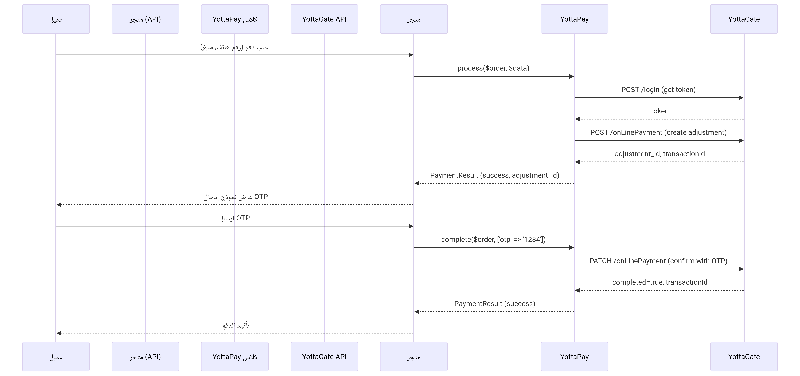

# توثيق بوابة الدفع YottaPay (Sabacash) – دليل المطور

## 1. نظرة عامة

**YottaPay** (العلامة التجارية: **Sabacash**) هي بوابة دفع إلكترونية مدمجة ضمن حزمة `Nano.Yepayment` في تطبيقات نانوسوفت. تعتمد البوابة على واجهة برمجة تطبيقات **YottaGate** وتستخدم آلية من خطوتين لإتمام المعاملات:

1. **إنشاء معاملة** (Create Adjustment) – يتم إرسال بيانات العميل والمبلغ والتيرمينال.
2. **تأكيد المعاملة** (Confirm Adjustment) – باستخدام رمز OTP يُرسل إلى العميل عبر رسالة نصية.

هذا الكلاس يمكن استخدامه مباشرة من خلال `Nano\Yepayment\PaymentTypes\YottaPay` أو عبر نظام المدفوعات الموحد `Nano\MicroCart\Classes\Payments\PaymentGateway`.

---

## 2. متطلبات التشغيل والإعدادات

### 2.1. المتطلبات الأساسية

- نظام نانوسوفت (Nano2Soft) الإصدار 2.0+
- إضافات مطلوبة:
  - `Nano.MicroCart` (>=2.0)
  - `Nano.Yepayment` (>=1.2)
  - `Nano.Helpers`
- بيانات الدخول إلى YottaGate (مقدمة من مشغل البوابة):
  - اسم المستخدم (`username`)
  - كلمة المرور (`password`)
  - رقم التيرمينال (`terminal`)
  - معرف العملة (`currencyId` – 1: ريال يمني، 2: ريال سعودي، إلخ)
  - رابط API الأساسي (مثال: `https://api.sabacash.com:49901`)

### 2.2. إعدادات البوابة في لوحة التحكم

عند تفعيل طريقة الدفع **"YottaPay (Sabacash)"**، تظهر الحقول التالية (تخزن في جدول `nano_microcart_payment_gateway_settings`):

| الحقل | المفتاح | الوصف |
|-------|---------|-------|
| رابط API الأساسي | `yottapay_url` | عنوان API الخاص بـ YottaGate |
| اسم المستخدم | `yottapay_username` | اسم مستخدم التاجر |
| كلمة المرور | `yottapay_password` | كلمة مرور التاجر (تخزن مشفرة) |
| رقم التيرمينال الافتراضي | `yottapay_default_terminal` | القيمة الافتراضية (مثلاً `"1"`) |
| معرف العملة الافتراضي | `yottapay_default_currency` | القيمة الافتراضية (مثلاً `"1"`) |

يمكن الوصول إلى هذه الإعدادات داخل الكلاس عبر:
```php
$url = PaymentGatewaySettings::get('yottapay_url', '');
$username = PaymentGatewaySettings::get('yottapay_username', '');
$terminal = PaymentGatewaySettings::get('yottapay_default_terminal', '1');
```

---

## 3. كلاس YottaPay – الطرق الأساسية

### 3.1. تعريف الكلاس

```php
namespace Nano\Yepayment\PaymentTypes;

use Nano\MicroCart\Classes\Payments\PaymentProvider;
use Nano\MicroCart\Classes\Payments\PaymentResult;
use Nano\MicroCart\Models\PaymentGatewaySettings;

class YottaPay extends PaymentProvider
{
    // ...
}
```

### 3.2. الخصائص الأساسية

| الخاصية | النوع | الوصف |
|----------|------|-------|
| `$order` | `Order` | كائن الطلب المرتبط بالدفع |
| `$data` | `array` | البيانات الواردة من المستخدم (رقم الهاتف، المبلغ، إلخ) |
| `$success_url` | `string` | (غير مستخدم في YottaPay لأن الدفع بدون redirect) |
| `$cancel_url` | `string` | (غير مستخدم) |

### 3.3. الطرق الرئيسية

#### `public function identifier(): string`
يعيد معرف فريد لطريقة الدفع (`yottapay`).

#### `public function name(): string`
يعيد الاسم المعروض (`YottaPay`).

#### `public function process(PaymentResult $result): PaymentResult`
ينشئ معاملة دفع جديدة عبر API.

**المدخلات المتوقعة في `$this->data` (من نموذج الدفع):**
- `source_phone` – رقم جوال المصدر (العميل)
- `terminal` – رقم التيرمينال (اختياري، يستخدم الافتراضي إن لم يوجد)
- `amount` – المبلغ
- `currency_id` – معرف العملة (اختياري)
- `note` – ملاحظة (اختياري)

**الإجراءات:**
1. التحقق من صحة البيانات عبر `checkValidate()`.
2. الحصول على توكن OAuth عبر `getAuthToken()`.
3. إرسال طلب POST إلى `/api/accounts/v1/adjustment/onLinePayment`.
4. حفظ `adjustment.id` في `order->payment_first_trans_id`.
5. حفظ بيانات المعاملة في `order->other_data['yottapay']`.
6. إرجاع `PaymentResult` مع `successful = true` ورسالة تطلب إدخال OTP.

#### `public function complete(PaymentResult $result): PaymentResult`
يؤكد الدفع باستخدام رمز OTP.

**المدخلات المطلوبة في `$this->data`:**
- `otp` – رمز OTP الذي استلمه العميل

**الإجراءات:**
1. استرداد `adjustmentId` من `order->payment_first_trans_id`.
2. إرسال طلب PATCH إلى `/api/accounts/v1/adjustment/onLinePayment` مع `id` و `otp`.
3. إذا كان `completed == true`، يتم تحديث حالة الطلب إلى مدفوع.
4. حفظ `transactionId` من الاستجابة في `order->payment_trans_id`.
5. إرجاع `PaymentResult` بنجاح أو فشل.

#### `public function getAuthToken(): ?string`
يطلب توكن OAuth من YottaGate.

**نقطة النهاية:** `POST /api/user-ms/v1/login`  
**البيانات:** `{"username": "...", "password": "..."}`  
**الإرجاع:** التوكن النصي أو `null` في حال الفشل.

#### `public function checkTransactionStatus($transactionId): array`
يستعلم عن حالة معاملة باستخدام معرف المعاملة (Transaction ID).

**نقطة النهاية:** `GET /api/accounts/v1/adjustment/checkAdjustmentByTransactionId?transactionId=...`  
**الإرجاع:** مصفوفة تحتوي على `success`, `status`, `statusCode`, `amount`, `transactionDate`.

#### `public function changePassword($oldPassword, $newPassword): array`
يغير كلمة مرور حساب التاجر (يستخدم في أدوات الاختبار).

**نقطة النهاية:** `PATCH /api/user-ms/v1/user/changeUserPassword`  
**البيانات:** `{"oldPassword": "...", "password": "..."}`

---

## 4. آلية الدفع خطوة بخطوة (للمطور)

### 4.1. تدفق العملية الكامل



### 4.2. دمج البوابة في واجهة برمجة تطبيقات (API) مخصصة

#### أ. إنشاء معاملة دفع (بدء الدفع)

**نقطة نهاية مخصصة في `routes/api.php`:**

```php
Route::post('/payment/yottapay/create', function (Request $request) {
    $order = Order::find($request->order_id);
    $yotta = new YottaPay($order, [
        'source_phone' => $request->source_phone,
        'amount'       => $request->amount,
        'terminal'     => $request->terminal ?? '1',
        'currency_id'  => $request->currency_id ?? '1',
        'note'         => $request->note,
    ]);
    $result = new PaymentResult($yotta, $order);
    $processResult = $yotta->process($result);
    return response()->json([
        'success' => $processResult->successful,
        'adjustment_id' => $order->payment_first_trans_id,
        'message' => $processResult->message,
    ]);
});
```

**طلب مثال:**
```json
POST /api/payment/yottapay/create
{
    "order_id": 200,
    "source_phone": "771234567",
    "amount": 1000,
    "terminal": "1",
    "currency_id": "1",
    "note": "دفع الطلب #200"
}
```

**استجابة:**
```json
{
    "success": true,
    "adjustment_id": "816613",
    "message": "تم إنشاء المعاملة، يرجى إدخال رمز OTP المرسل إلى جوالك"
}
```

#### ب. تأكيد الدفع باستخدام OTP

**نقطة نهاية التأكيد:**

```php
Route::post('/payment/yottapay/confirm', function (Request $request) {
    $order = Order::find($request->order_id);
    $yotta = new YottaPay($order, ['otp' => $request->otp]);
    $result = new PaymentResult($yotta, $order);
    $confirmResult = $yotta->complete($result);
    return response()->json([
        'success' => $confirmResult->successful,
        'transaction_id' => $order->payment_trans_id,
        'message' => $confirmResult->message,
    ]);
});
```

**طلب مثال:**
```json
POST /api/payment/yottapay/confirm
{
    "order_id": 200,
    "otp": "4320"
}
```

**استجابة نجاح:**
```json
{
    "success": true,
    "transaction_id": "DF-01-0123456-0123456789",
    "message": "تم تأكيد الدفع بنجاح"
}
```

#### ج. التحقق من حالة المعاملة

```php
Route::get('/payment/yottapay/status', function (Request $request) {
    $yotta = new YottaPay();
    $status = $yotta->checkTransactionStatus($request->transaction_id);
    return response()->json($status);
});
```

**طلب:**
```
GET /api/payment/yottapay/status?transaction_id=DF-01-0123456-0123456789
```

**استجابة:**
```json
{
    "success": true,
    "status": "completed",
    "statusCode": "completed",
    "amount": "1000.000000",
    "transactionDate": "1655714348044"
}
```

---

## 5. نقاط نهاية الاختبار المضمنة في `routes.php`

ضمن ملف `routes.php` الخاص بـ `Nano.Yepayment`، تم توفير مجموعة من نقاط النهاية المساعدة تحت المجموعة `/api/v1/yepayment`، والمخصصة للمطورين والمسؤولين لاختبار البوابة.

### 5.1. قائمة نقاط النهاية

| المسار | الطريقة | الوصف |
|--------|---------|-------|
| `/yottapay/test-auth` | POST | اختبار المصادقة مع YottaGate (الحصول على توكن) |
| `/yottapay/test-create-payment` | POST | إنشاء معاملة تجريبية (يحاكي `process`) |
| `/yottapay/test-confirm-payment` | POST | تأكيد معاملة باستخدام OTP تجريبي |
| `/yottapay/test-check-status` | GET | التحقق من حالة معاملة باستخدام `transaction_id` |
| `/yottapay/test-full-payment` | POST | اختبار شامل (إنشاء + تأكيد + استعلام) |
| `/yottapay/test-change-password` | POST | اختبار تغيير كلمة المرور |
| `/yottapay/stats` | GET | إحصائيات استخدام البوابة (عدد الطلبات، نسبة النجاح) |
| `/yottapay/test-ui` | GET | واجهة ويب تفاعلية لاختبار جميع الوظائف |

### 5.2. شرح كل نقطة نهاية

#### `POST /yottapay/test-auth`
لا تحتاج إلى بيانات إدخال (تستخدم الإعدادات المخزنة).  
**الاستجابة:** `{ success, token, token_length }`

#### `POST /yottapay/test-create-payment`
**بيانات الطلب (JSON):**
```json
{
    "order_id": 200,
    "source_phone": "771234567",
    "terminal": "1",
    "amount": 1000,
    "currency_id": "1",
    "note": "اختبار"
}
```
**الاستجابة:** `{ success, adjustment_id, transaction_id, order_data }`

#### `POST /yottapay/test-confirm-payment`
**بيانات الطلب:**
```json
{
    "order_id": 200,
    "adjustment_id": "816613",
    "otp": "4320",
    "note": "تأكيد"
}
```
**الاستجابة:** `{ success, transaction_id, completed }`

#### `GET /yottapay/test-check-status?transaction_id=...`
**الاستجابة:** `{ success, status, statusCode, amount, transactionDate }`

#### `POST /yottapay/test-full-payment`
يقوم بتنفيذ الخطوات الثلاث تلقائياً (إنشاء، تأكيد بـ OTP تجريبي `1234`، استعلام).  
**الاستجابة:** تحتوي على `results` (نتائج كل خطوة) و `summary`.

#### `GET /yottapay/test-ui`
يعرض واجهة HTML متكاملة تحتوي على:
- اختبار يدوي خطوة بخطوة
- اختبار تلقائي بعدد مرات قابل للتحديد
- إحصائيات فورية
- سجلات الاختبارات المخزنة في LocalStorage
- أدوات إضافية (تغيير كلمة المرور، اختبار الاتصال، تصدير السجلات)

#### `GET /yottapay/stats`
**الاستجابة:** إحصائيات مثل `total_orders`, `yottapay_orders`, `successful_payments`, `success_rate`, إعدادات البوابة.

---

## 6. التعامل مع البوابة عبر API خارجي (للتطبيقات الأخرى)

إذا كنت تطور تطبيقاً خارجياً (مثلاً تطبيق جوال أو متجر إلكتروني مستقل) وترغب في دمج YottaPay دون استخدام كلاس `YottaPay` مباشرة، يمكنك الاتصال بـ **نقاط النهاية العامة** التي يوفرها النظام (المذكورة أعلاه) بعد المصادقة عبر `oauth-users`.

### 6.1. المصادقة المسبقة

يجب أن يكون لديك توكن OAuth 2.0 صالح (يمكن الحصول عليه من نظام نانوسوفت عبر نقطة نهاية تسجيل الدخول المعتادة). ثم ترسل التوكن في الهيدر:
```
Authorization: Bearer <token>
```

### 6.2. مثال متكامل باستخدام cURL

#### أ. إنشاء معاملة
```bash
curl -X POST "https://yourdomain.com/api/v1/yepayment/yottapay/test-create-payment" \
  -H "Authorization: Bearer <token>" \
  -H "Content-Type: application/json" \
  -d '{
    "order_id": 200,
    "source_phone": "771234567",
    "amount": 1000,
    "terminal": "1",
    "currency_id": "1",
    "note": "شراء منتج"
  }'
```

#### ب. تأكيد الدفع
```bash
curl -X POST "https://yourdomain.com/api/v1/yepayment/yottapay/test-confirm-payment" \
  -H "Authorization: Bearer <token>" \
  -H "Content-Type: application/json" \
  -d '{
    "order_id": 200,
    "adjustment_id": "816613",
    "otp": "4320"
  }'
```

#### ج. التحقق من الحالة
```bash
curl -X GET "https://yourdomain.com/api/v1/yepayment/yottapay/test-check-status?transaction_id=DF-01-..." \
  -H "Authorization: Bearer <token>"
```

> **ملاحظة:** نقاط النهاية هذه محمية بـ `BackendAuth` أيضاً (تتطلب أن يكون المستخدم مسؤولاً). إذا كنت تريد توفيرها للعملاء العاديين، يجب تعديل `routes.php` لإزالة فحص `BackendAuth` أو إضافة middleware مخصص.

---

## 7. رموز الأخطاء الشائعة والحلول

| كود HTTP | الخطأ (من YottaGate) | السبب والحل |
|----------|----------------------|--------------|
| 401 | Unauthorized | فشل المصادقة – تحقق من `username`/`password` في الإعدادات. |
| 400 | entity of mobile [xxx] is not exists | رقم الهاتف غير مسجل في نظام YottaGate – تأكد من صحة الرقم. |
| 400 | Sender do not has sufficient balance | رصيد المصدر (العميل) غير كافٍ. |
| 400 | can not do transaction, you Already did transaction | تم تأكيد المعاملة سابقاً – لا تحاول التأكيد مجدداً. |
| 400 | Operation expired, this Operation Timed out | انتهت صلاحية المعاملة – أعد إنشاء معاملة جديدة. |
| 400 | anonymous users can not perform any transaction | التوكن غير صالح أو منتهي – أعد طلب توكن جديد. |
| 404 | Entered id [xxx] does not exist | `adjustment_id` غير موجود – تحقق من `payment_first_trans_id`. |

---

## 8. أمثلة عملية لاستخدام الكلاس في كود مخصص

### 8.1. إنشاء معاملة بدون استخدام `PaymentGateway`

```php
use Nano\Yepayment\PaymentTypes\YottaPay;
use Nano\Orders\Models\Order;

$order = Order::find(200);
$yotta = new YottaPay($order, [
    'source_phone' => '771234567',
    'amount'       => 1000,
    'terminal'     => '1',
    'currency_id'  => '1',
    'note'         => 'دفع الطلب #200',
]);

$paymentResult = new \Nano\MicroCart\Classes\Payments\PaymentResult($yotta, $order);
$processResult = $yotta->process($paymentResult);

if ($processResult->successful) {
    $adjustmentId = $order->payment_first_trans_id;
    // تخزين adjustmentId في الجلسة أو إرساله إلى العميل
}
```

### 8.2. تأكيد الدفع

```php
$yotta = new YottaPay($order, ['otp' => '4320']);
$confirmResult = $yotta->complete($paymentResult);
if ($confirmResult->successful) {
    // الدفع تم بنجاح
}
```

### 8.3. استخدام دالة تغيير كلمة المرور

```php
$yotta = new YottaPay();
$result = $yotta->changePassword('old123', 'new456');
if ($result['success']) {
    echo "تم تغيير كلمة المرور";
}
```

---

## 9. ملخص نقاط النهاية في `routes.php` (مرجع سريع)

| المسار الكامل | الطريقة | الاستخدام |
|---------------|---------|-----------|
| `/api/v1/yepayment/yottapay/test-auth` | POST | اختبار بيانات الدخول |
| `/api/v1/yepayment/yottapay/test-create-payment` | POST | إنشاء معاملة تجريبية |
| `/api/v1/yepayment/yottapay/test-confirm-payment` | POST | تأكيد معاملة بـ OTP |
| `/api/v1/yepayment/yottapay/test-check-status` | GET | الاستعلام عن حالة معاملة |
| `/api/v1/yepayment/yottapay/test-full-payment` | POST | اختبار شامل (إنشاء + تأكيد + استعلام) |
| `/api/v1/yepayment/yottapay/test-change-password` | POST | تغيير كلمة مرور حساب التاجر |
| `/api/v1/yepayment/yottapay/test-ui` | GET | واجهة اختبار ويب |
| `/api/v1/yepayment/yottapay/stats` | GET | إحصائيات البوابة |

> **ملاحظة:** جميع هذه النقاط تتطلب أن يكون المستخدم الحالي مديراً (`BackendAuth`). لإتاحتها لعملاء API عاديين، قم بتعديل `routes.php` أو أضف middleware مخصص.

---

## 10. المراجع

- [كلاس YottaPay.php](./YottaPay.php) – الكود الكامل للبوابة.
- [ملف routes.php](./routes.php) – تعريف نقاط النهاية الخاصة بـ YottaPay.
- [مجموعة Postman (Sabacash)](./Sabacash%20online%20payment.postman_collection.json)
- [API Online Payments v1.3](./API%20Online%20Payments%20v%201.3.pdf)
- [API Online Payment Return v1.4](./API%20Online%20Payment%20Return%20v%201.4.pdf)
- [API Online Status Check v1.3](./API%20Online%20Status%20Check%20v1.3.pdf)
- [YottaPay Login & Change Password](./yottaPay%20Login%20-%20Change%20My%20Password%20API%20Documentation%20V.1.1.pdf)

---

**تم إعداد هذا التوثيق لمساعدة المطورين على دمج واستخدام بوابة YottaPay (Sabacash) بسهولة وفعالية.**  
للاستفسارات أو الدعم الفني، يرجى التواصل عبر الموقع الرسمي [nano2soft.com](https://nano2soft.com).
