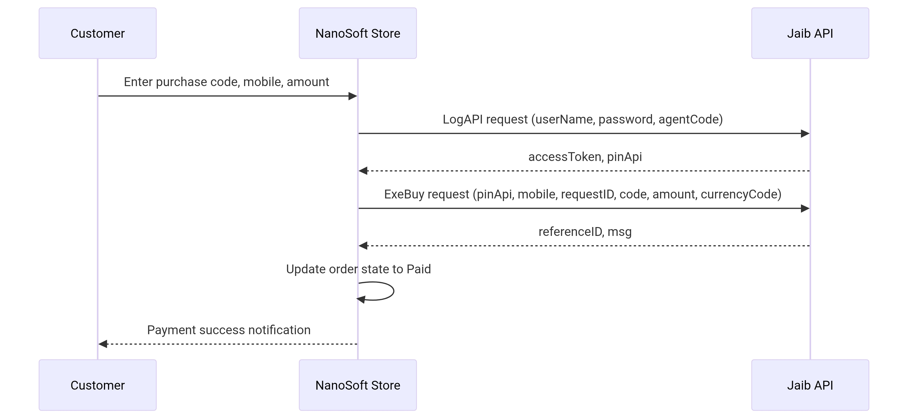

# JaibPay Payment Gateway Documentation (Jaib Wallet) – Developer Guide

## 1. Overview

**JaibPay** is an electronic payment gateway integrated within the `Nano.Yepayment` package in NanoSoft applications. The gateway relies on the **Jaib Wallet API** and uses a **Direct Payment** mechanism in a single step:

1. **Execute Buy Online By Code** – The customer enters a purchase code previously generated in the Jaib app, and the amount is immediately deducted from their balance without requiring additional confirmation or OTP.

This class can be used directly via `Nano\Yepayment\PaymentTypes\JaibPay` or through the unified payment system `Nano\MicroCart\Classes\Payments\PaymentGateway`.

---

## 2. Requirements and Configuration

### 2.1. Prerequisites

- NanoSoft system version 2.0+
- Required plugins:
  - `Nano.MicroCart` (>=2.0)
  - `Nano.Yepayment` (>=1.2)
  - `Nano.Helpers`
- Jaib API credentials (provided by the gateway operator):
  - Username (`userName`)
  - Password (`password`)
  - Agent code (`agentCode` – default `10004`)
  - Base API URL (example: `https://www.api2.e-jaib.com:5088`)

### 2.2. Gateway Settings in the Control Panel

When you activate the payment method **"Jaib Pay (Jaib Wallet)"**, the following fields appear (stored in `nano_microcart_payment_gateway_settings`):

| Field | Key | Description |
|-------|-----|-------------|
| Base API URL | `jaibpay_url` | Jaib API endpoint (e.g., `https://www.api2.e-jaib.com:5088`) |
| Test API URL | `jaibpay_test_url` | (Optional) Test environment URL |
| Username | `jaibpay_username` | Merchant username |
| Password | `jaibpay_password` | Merchant password (encrypted) |
| Agent Code | `jaibpay_agentcode` | Agent code provided by Jaib (default `10004`) |
| Default Currency | `jaibpay_default_currency` | Default currency (YER, USD, SAR) |

Access these settings inside the class via:
```php
$url = PaymentGatewaySettings::get('jaibpay_url', '');
$username = PaymentGatewaySettings::get('jaibpay_username', '');
$agentCode = PaymentGatewaySettings::get('jaibpay_agentcode', '10004');
```

---

## 3. JaibPay Class – Core Methods

### 3.1. Class Definition

```php
namespace Nano\Yepayment\PaymentTypes;

use Nano\MicroCart\Classes\Payments\PaymentProvider;
use Nano\MicroCart\Classes\Payments\PaymentResult;
use Nano\MicroCart\Models\PaymentGatewaySettings;

class JaibPay extends PaymentProvider
{
    // ...
}
```

### 3.2. Basic Properties

| Property | Type | Description |
|----------|------|-------------|
| `$order` | `Order` | The order object associated with the payment |
| `$data` | `array` | User input data (purchase code, mobile, amount, etc.) |
| `$success_url` | `string` | (Not used in JaibPay because payment is direct, no redirect) |
| `$cancel_url` | `string` | (Not used) |

### 3.3. Main Methods

#### `public function identifier(): string`
Returns a unique identifier for the payment method (`jaibpay`).

#### `public function name(): string`
Returns the display name (`Jaib Pay (Jaib Wallet)`).

#### `public function process(PaymentResult $result): PaymentResult`
Creates a new charge (executes direct payment) via API.

**Expected input in `$this->data` (from payment form):**
- `purchase_code` – Purchase code (required)
- `mobile` – Customer mobile number (required)
- `amount` – Amount (required)
- `currency` – Currency (optional, uses default if missing)
- `notes` – Notes (optional)

**Actions:**
1. Validate input via `defineValidationRules()`.
2. Obtain `accessToken` and `pinApi` via `getAuthToken()` (from cache or API).
3. Generate a unique `requestID` (UUID).
4. Send POST request to `/api/v1/BuyOnline/ExeBuy` with the data.
5. If successful, store `requestID` in `order->payment_first_trans_id` and `referenceID` in `order->payment_trans_id`.
6. Save additional data in `order->other_data['jaibpay']`.
7. Update order state to `PaidState` via `$result->success()`.
8. Return successful `PaymentResult`.

#### `public function complete(PaymentResult $result): PaymentResult`
Not used in this type (direct payment). Left empty or can be used for refunds in the future.

#### `private function getAuthToken(): ?array`
Requests `accessToken` and `pinApi` from Jaib API.

**Endpoint:** `POST /api/v1/TokenAuth/LogAPI`  
**Data:** `{"userName": "...", "password": "...", "agentCode": "..."}`  
**Return:** Array with `accessToken`, `pinApi`, `expire` or `null` on failure.  
**Caching:** Stored in cache for 86000 seconds.

#### `private function executeBuy(string $accessToken, string $pinApi, string $requestID): array`
Executes the purchase using the code.

**Endpoint:** `POST /api/v1/BuyOnline/ExeBuy`  
**Data:** `{"pinApi": "...", "mobile": "...", "requestID": "...", "code": "...", "amount": ..., "currencyCode": "...", "notes": "..."}`  
**Return:** Array with `success`, `referenceID`, `requestID`, `msg`, `amount`, `currencyCode`.

#### `public function checkTransactionStatus(string $requestID): array`
Queries transaction status using `requestID`.

**Endpoint:** `POST /api/v1/BuyOnline/CheckProgress`  
**Data:** `{"pinApi": "...", "requestID": "..."}`  
**Return:** Array with `success`, `request_id`, `reference_id`, `raw_response`.

#### `private function getApiUrl(string $type): string`
Builds API URLs based on type (`login`, `buy`, `refund`, `check`).

#### `private function parseResponse($response): array`
Converts Guzzle response to PHP array.

---

## 4. Payment Workflow Step by Step (for Developers)

### 4.1. Complete Process Flow



### 4.2. Integrating the Gateway into a Custom API

#### A. Create a new charge (initiate payment)

**Custom endpoint in `routes/api.php`:**

```php
Route::post('/payment/jaibpay/create', function (Request $request) {
    $order = Order::find($request->order_id);
    $jaib = new JaibPay($order, [
        'purchase_code' => $request->purchase_code,
        'mobile'        => $request->mobile,
        'amount'        => $request->amount,
        'currency'      => $request->currency ?? 'YER',
        'notes'         => $request->notes,
    ]);
    $result = new PaymentResult($jaib, $order);
    $processResult = $jaib->process($result);
    return response()->json([
        'success'      => $processResult->successful,
        'request_id'   => $order->payment_first_trans_id,
        'reference_id' => $order->payment_trans_id,
        'message'      => $processResult->message,
    ]);
});
```

**Example request:**
```json
POST /api/payment/jaibpay/create
{
    "order_id": 200,
    "purchase_code": "3719",
    "mobile": "774760761",
    "amount": 5000,
    "currency": "YER",
    "notes": "Payment for order #200"
}
```

**Response:**
```json
{
    "success": true,
    "request_id": "550e8400-e29b-41d4-a716-446655440000",
    "reference_id": "16986110064345",
    "message": "Payment completed successfully"
}
```

#### B. Query transaction status

```php
Route::get('/payment/jaibpay/status', function (Request $request) {
    $jaib = new JaibPay();
    $status = $jaib->checkTransactionStatus($request->request_id);
    return response()->json($status);
});
```

**Request:**
```
GET /api/payment/jaibpay/status?request_id=550e8400-e29b-41d4-a716-446655440000
```

**Response:**
```json
{
    "success": true,
    "request_id": "550e8400-e29b-41d4-a716-446655440000",
    "reference_id": "16986110064345",
    "raw_response": { ... }
}
```

---

## 5. Built-in Test Endpoints in `routes.php`

Within the `routes.php` file of `Nano.Yepayment`, a set of helper endpoints is provided under the group `/api/v1/yepayment`, dedicated to developers and administrators for testing the gateway.

### 5.1. List of Endpoints

| Endpoint | Method | Description |
|----------|--------|-------------|
| `/jaibpay/test-auth` | POST | Test authentication with Jaib API (obtain accessToken and pinApi) |
| `/jaibpay/test-create-payment` | POST | Create a new charge (execute direct payment) |
| `/jaibpay/test-check-status` | GET | Query transaction status using `request_id` |
| `/jaibpay/test-full-payment` | POST | Full test (create charge + query) |
| `/jaibpay/stats` | GET | Gateway statistics (order counts, success rate) |
| `/jaibpay/test-ui` | GET | Interactive web UI to test all functions |

### 5.2. Explanation of Each Endpoint

#### `POST /jaibpay/test-auth`
No input required (uses stored settings).  
**Response:** `{ success, data: { access_token_length, pin_api, expire } }`

#### `POST /jaibpay/test-create-payment`
**Request body (JSON):**
```json
{
    "order_id": 200,
    "purchase_code": "3719",
    "mobile": "774760761",
    "amount": 5000,
    "currency": "YER",
    "notes": "test"
}
```
**Response:** `{ success, data: { request_id, reference_id, api_data }, order_data }`

#### `GET /jaibpay/test-check-status?request_id=...`
**Response:** `{ success, request_id, reference_id, raw_response }`

#### `POST /jaibpay/test-full-payment`
Executes two steps automatically (create charge + query).  
**Response:** Contains `results` (each step result) and `summary`.

#### `GET /jaibpay/test-ui`
Displays an HTML interface containing:
- Manual step-by-step testing (create charge, query, full test)
- Automatic test with configurable repetitions (1-10)
- Real-time statistics (order counts, success rate, recent logs)
- Test logs stored in LocalStorage
- Additional tools (connection test, export logs, reset)

#### `GET /jaibpay/stats`
**Response:** Statistics such as `total_orders`, `jaibpay_orders`, `successful_payments`, `success_rate`, gateway settings.

---

## 6. Using the Gateway via External API (for other applications)

If you are developing an external application (e.g., a mobile app or an independent e-commerce store) and wish to integrate JaibPay without using the `JaibPay` class directly, you can call the **public endpoints** provided by the system (listed above) after authenticating via `oauth-users`.

### 6.1. Pre-authentication

You must have a valid OAuth 2.0 token (can be obtained from the NanoSoft system via the usual login endpoint). Then send the token in the header:
```
Authorization: Bearer <token>
```

### 6.2. Complete example using cURL

#### A. Create a new charge
```bash
curl -X POST "https://yourdomain.com/api/v1/yepayment/jaibpay/test-create-payment" \
  -H "Authorization: Bearer <token>" \
  -H "Content-Type: application/json" \
  -d '{
    "order_id": 200,
    "purchase_code": "3719",
    "mobile": "774760761",
    "amount": 5000,
    "currency": "YER",
    "notes": "Product purchase"
  }'
```

#### B. Query charge status
```bash
curl -X GET "https://yourdomain.com/api/v1/yepayment/jaibpay/test-check-status?request_id=550e8400-e29b-41d4-a716-446655440000" \
  -H "Authorization: Bearer <token>"
```

> **Note:** These endpoints are also protected by `BackendAuth` (require administrator privileges). If you want to expose them to regular customers, you must modify `routes.php` to remove the `BackendAuth` check or add a custom middleware.

---

## 7. Common Error Codes and Solutions

| HTTP Code | Jaib API Error | Cause and Solution |
|-----------|----------------|---------------------|
| 401 | Unauthorized | Authentication failed – check `userName`/`password`/`agentCode` in settings. |
| 400 | "Invalid code" (code 51) | Purchase code is incorrect or expired – verify the entered code. |
| 400 | "Code already used" (code -1026) | Code has already been consumed – use a new code. |
| 400 | "Insufficient balance" | Customer's Jaib wallet balance is insufficient for the requested amount. |
| 400 | "Transaction not found" | `requestID` is incorrect – check the stored identifier. |
| 500 | Internal Server Error | Connection issue with Jaib API – verify the URL, or try again later. |

---

## 8. Practical Examples of Using the Class in Custom Code

### 8.1. Create a new charge without using `PaymentGateway`

```php
use Nano\Yepayment\PaymentTypes\JaibPay;
use Nano\Orders\Models\Order;

$order = Order::find(200);
$jaib = new JaibPay($order, [
    'purchase_code' => '3719',
    'mobile'        => '774760761',
    'amount'        => 5000,
    'currency'      => 'YER',
    'notes'         => 'Payment for order #200',
]);

$paymentResult = new \Nano\MicroCart\Classes\Payments\PaymentResult($jaib, $order);
$processResult = $jaib->process($paymentResult);

if ($processResult->successful) {
    $requestID = $order->payment_first_trans_id;
    $referenceID = $order->payment_trans_id;
    // Redirect customer to success page
}
```

### 8.2. Query transaction status

```php
$jaib = new JaibPay();
$status = $jaib->checkTransactionStatus('550e8400-e29b-41d4-a716-446655440000');
if ($status['success']) {
    echo "Reference ID: " . $status['reference_id'];
}
```

### 8.3. Use authentication method to obtain token only

```php
$jaib = new JaibPay();
$auth = $jaib->getAuthToken(); // Returns array with accessToken, pinApi
if ($auth) {
    echo "Token: " . $auth['accessToken'];
}
```

---

## 9. Summary of Endpoints in `routes.php` (Quick Reference)

| Full Endpoint | Method | Usage |
|---------------|--------|-------|
| `/api/v1/yepayment/jaibpay/test-auth` | POST | Test credentials |
| `/api/v1/yepayment/jaibpay/test-create-payment` | POST | Create a new charge |
| `/api/v1/yepayment/jaibpay/test-check-status` | GET | Query transaction status |
| `/api/v1/yepayment/jaibpay/test-full-payment` | POST | Full test (create + query) |
| `/api/v1/yepayment/jaibpay/stats` | GET | Gateway statistics |
| `/api/v1/yepayment/jaibpay/test-ui` | GET | Web test UI |

> **Note:** All these endpoints require the current user to be an administrator (`BackendAuth`). To expose them to regular API clients, modify `routes.php` or add custom middleware.

---

## 10. References

- [JaibPay.php class](./JaibPay.php) – Full gateway code.
- [routes.php file](./routes.php) – Definition of JaibPay endpoints.
- [Jaib Pay API – Login Documentation](./Login.pdf)
- [Jaib Pay API – Execute & Check Documentation](./Jaib%20Wallet%20Pay%20API.pdf)
- [Jaib Pay API Postman Collection](./Jaib%20Pay%20API.postman_collection.json)

---

**This documentation is intended to help developers integrate and use the JaibPay (Jaib Wallet) gateway easily and effectively.**  
For inquiries or technical support, please contact us via the official website [nano2soft.com](https://nano2soft.com).
