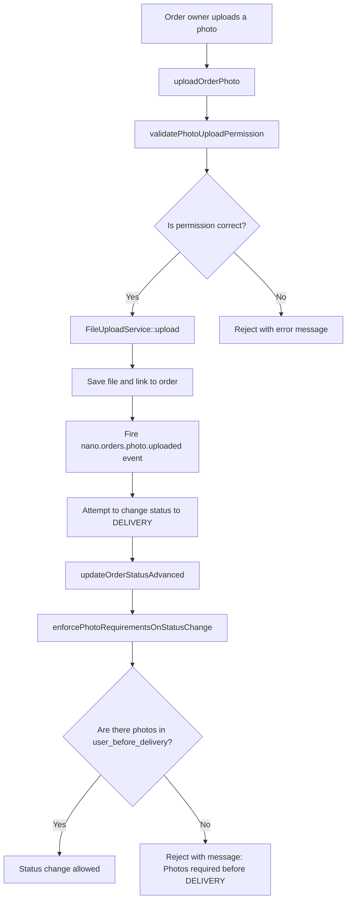

# Advanced Documentation for `StepPhotos` Trait – Step-by-Step Mechanism

**Namespace:** `Nano\Orders\Traits\Steps`  
**Plugin:** `Nano.Orders`  
**Version:** 2.2.12  

---

## 📋 Introduction

This document provides a detailed explanation of the `StepPhotos` trait's internal mechanism, focusing on the **logical sequence** of its main functions, interaction with `Nano.FileUpload`, error handling, caching strategies, and multi-level permission validation. It is recommended to read the basic trait documentation first before diving into this advanced document.

---

## 🔹 Step 1: Rules Initialization and Caching

### `getDefaultPhotoUploadRules()`

When any function requiring photo rules is called for the first time, this function is invoked. It goes through the following stages:

1. **Cache check** – Checks `self::$cachedPhotoRules`. If a value exists, it returns immediately to avoid rebuilding the array.
2. **Build default rules** – Creates a `$rules` array containing default settings for the four fields:
   - `user_before_delivery`
   - `user_after_delivery`
   - `delivery_before_delivery`
   - `delivery_after_delivery`
3. **Merge with config settings** – Reads `Config::get('nano.orders::photo_rules', [])` and merges with default rules using `array_replace_recursive` (without losing keys not present in config).
4. **Store result in cache** – Places the final array in `self::$cachedPhotoRules` for subsequent calls.
5. **Return** – Returns the complete array.

**Why caching?**  
This function is called multiple times per request (in `validatePhotoUploadPermission`, `uploadOrderPhoto`, `enforcePhotoRequirementsOnStatusChange`). Caching prevents rebuilding the rule array hundreds of times.

---

## 🔹 Step 2: Upload Single Photo (`uploadOrderPhoto`)

This function is the **main entry point** for uploading photos. It goes through sequential stages to ensure security and integration with `Nano.FileUpload`.

### Stage 2.1: Verify Order Existence

```php
$order = $options['order'] ?? $this->getOrderModel();
if (!$order || !$order->exists) {
    throw new ApplicationException(trans('nano.orders::lang.manager.photo.order_not_found'));
}
```
- If `order` is not passed in options, uses `$this->getOrderModel()` (from `OrderManager`).
- Verifies the order exists and is saved in the database (`exists`).

### Stage 2.2: Validate Field Name

```php
$allowedFields = ['user_before_delivery', 'user_after_delivery', 'delivery_before_delivery', 'delivery_after_delivery'];
if (!in_array($field, $allowedFields)) {
    throw new ApplicationException('Invalid field name.');
}
```
- **Why this check?**  
  Prevents a malicious user from passing `field = 'image'` or `field = 'files'` (other relationships in `Order`) and bypassing the constraints set for dedicated photo fields.

### Stage 2.3: Extract File Data

```php
if (!$fileData && Input::hasFile($field)) {
    $fileData = Input::file($field);
}
if (!$fileData) {
    throw new ApplicationException(trans('nano.orders::lang.manager.photo.file_required'));
}
```
- Supports two sources for files:
  1. **Direct passing** (`UploadedFile` object or `base64` string).
  2. **Extraction from `Input::file()`** (for `multipart/form-data` requests).
- If no file is found in either source, throws an exception.

### Stage 2.4: Determine Actor and Validate Permission

```php
$actor = $options['user'] ?? $this->resolveActor();
$skipPermission = $options['skip_permission'] ?? false;

if (!$skipPermission) {
    $this->validatePhotoUploadPermission($field, $actor, $order, null, $options);
}
```
- Uses `resolveActor()` to determine the current user (same logic as `updateOrderStatusAdvanced`).
- If `skip_permission = true`, bypasses permission validation (used for testing or for administrators in special scenarios).

### Stage 2.5: Prepare Upload Options for `FileUploadService`

```php
$uploadOptions = [
    'model' => $order,
    'title' => $options['title'] ?? $field,
    'description' => $options['description'] ?? null,
    'is_public' => $options['is_public'] ?? false,
    'field' => $field,
    'auto_resize' => $options['auto_resize'] ?? false,
    'resize_options' => $options['resize_options'] ?? [],
    'auto_watermark' => $options['auto_watermark'] ?? false,
    'watermark_options' => $options['watermark_options'] ?? [],
];
```
- Passes additional options like `auto_resize` and `auto_watermark` to support automatic image processing (resizing, watermarking).

### Stage 2.6: Call File Upload Service

```php
$uploadResult = FileUploadService::instance()->upload(
    get_class($order),
    $field,
    $fileData,
    $uploadOptions
);
```
- `FileUploadService` handles:
  - Validating field settings registered in `FileUploadRegistry` (max size, allowed types).
  - Saving the file to the specified disk (local, S3, etc.).
  - Creating a record in the `system_files` table with `hash`, `meta`, and `session_key`.
  - Linking the file to the order via `attachment_type` and `attachment_id` (if `model` is passed).

### Stage 2.7: Process Result and Extract File Object

```php
$newFile = $uploadResult['model'] ?? null;
if (!$newFile && isset($uploadResult['data']['id'])) {
    $newFile = \System\Models\File::find($uploadResult['data']['id']);
}
```
- `FileUploadService::upload` returns `model` in the array (in recent versions), but as a precaution, if not found, attempts to find the file using the `id` from `data`.

### Stage 2.8: Fire `nano.orders.photo.uploaded` Event

```php
if ($newFile) {
    Event::fire('nano.orders.photo.uploaded', [
        'order' => $order,
        'field' => $field,
        'file' => $newFile,
        'actor' => $actor,
    ]);
}
```
- Developers can listen to this event to send WebSocket notifications, log activity, or update statistics.

### Stage 2.9: Return Response

```php
$result['data'] = $uploadResult['data'];
$result['process_data'] = $uploadResult['process_data'];
$result['message'] = $options['custom_message'] ?? $result['message'];
```

---

## 🔹 Step 3: Permission Validation (`validatePhotoUploadPermission`)

This function is the **core of the permission system** in the trait. It works in the following order:

### Stage 3.1: Fetch Appropriate Rules

```php
$rules = $options['rules'] ?? $this->getDefaultPhotoUploadRules();
$fieldRules = $rules[$field] ?? null;

if (!$fieldRules) {
    return; // No specific rules for this field → allow (can be uploaded at any time)
}
```
- If rules are empty, upload is allowed (safe behavior: no constraints means no blocking).

### Stage 3.2: Determine User Role

```php
$role = $this->getUserRoleForOrder($user, $order);
if (!$role && !($user instanceof \Backend\Models\User)) {
    throw new ApplicationException(trans('nano.orders::lang.manager.photo.no_permission'));
}
```
- `getUserRoleForOrder` returns `'user'`, `'delivery'`, `'admin'`, or `null`.
- User not associated with the order and not an administrator → rejection.

### Stage 3.3: Check Allowed Role

```php
$allowedRoles = $options['allowed_roles'] ?? ($fieldRules['allowed_roles'] ?? []);
if (!in_array($role, $allowedRoles) && $role !== 'admin') {
    throw new ApplicationException(trans('nano.orders::lang.manager.photo.role_not_allowed', [
        'role' => $role,
        'field' => $field,
    ]));
}
```
- Administrator (`admin`) is always allowed (no need to list in `allowed_roles`).

### Stage 3.4: Check Allowed Status for Upload

```php
$allowedStatuses = $options['allowed_statuses'] ?? ($fieldRules['allowed_statuses'] ?? []);
if (!empty($allowedStatuses) && !in_array($order->order_states_ref_type, $allowedStatuses)) {
    throw new ApplicationException(trans('nano.orders::lang.manager.photo.status_not_allowed', [
        'status' => $order->order_states_ref_type,
        'field' => $field,
    ]));
}
```
- If the list is empty, the constraint is not applied (allowed to upload in any status).

### Stage 3.5: Check Maximum Number of Files

```php
if (($fieldRules['max_files'] ?? 0) > 0 && $order->{$field}()->count() >= $fieldRules['max_files']) {
    throw new ApplicationException(trans('nano.orders::lang.manager.photo.max_files_reached', [
        'max' => $fieldRules['max_files'],
        'field' => $field,
    ]));
}
```
- Uses `count()` for `attachMany` relationships. If the field is single (`attachOne`), this check is not applied (controlled via `max_files = 1`).

### Stage 3.6: Check New Status Requirements (Optional)

```php
if ($newStatus) {
    $requiredOnTransition = $options['required_on_transition'] ?? ($fieldRules['required_on_transition'] ?? []);
    if (in_array($newStatus, $requiredOnTransition)) {
        $count = $order->{$field}()->count();
        if ($count == 0) {
            throw new ApplicationException(trans('nano.orders::lang.manager.photo.required_before_transition', [
                'field' => $field,
                'status' => $newStatus,
            ]));
        }
    }
}
```
- This check is used when attempting to change the order status (`updateOrderStatusAdvanced`) to verify that required photos exist before transitioning.

---

## 🔹 Step 4: Upload Multiple Photos (`uploadOrderPhotos`)

This function is a **safe iterative loop** for uploading a set of photos.

### Stage 4.1: Process Input

```php
if ((!$filesData || empty($filesData)) && Input::hasFile($field)) {
    $filesData = Input::file($field);
}

if (!empty($filesData) && !is_array($filesData)) {
    $filesData = [$filesData];
}

if (!$filesData || !is_array($filesData)) {
    throw new ApplicationException(trans('nano.orders::lang.manager.photo.files_array_required'));
}
```
- If the file array is not passed, attempts to retrieve it from `Input::file($field)` (which may return an array if the field is `multiple` in HTML).
- If the value is singular (not an array), converts it to an array.
- If still empty or not an array, rejects.

### Stage 4.2: Check Permission Once

```php
if (!$skipPermission) {
    $this->validatePhotoUploadPermission($field, $actor, $order, null, $options);
}
```
- Checks user permission for uploading photos to this field **only once** before iteration, rather than checking per file (performance optimization).

### Stage 4.3: Iterate Over Files

```php
foreach ($filesData as $index => $fileData) {
    $singleResult = $this->uploadOrderPhoto($field, $fileData, array_merge($options, ['skip_permission' => true]));
    // ...
}
```
- Passes `skip_permission = true` to each individual call because permission was already checked.
- Collects results, success count, and errors.

### Stage 4.4: Determine Final Response Code

```php
$result['code'] = $successCount === count($filesData) ? 200 : 207; // 207 Partial Content
```
- `200` (all files succeeded).
- `207` (some succeeded, some failed).

---

## 🔹 Step 5: Delete Photo (`deleteOrderPhoto`)

The deletion process is simpler, but still includes permission validation.

### Stage 5.1: Verify File Existence

```php
$file = $order->{$field}()->find($fileId);
if (!$file) {
    throw new ApplicationException(trans('nano.orders::lang.manager.photo.file_not_found'));
}
```
- Searches for the file in the field's relationship. If not found (maybe already deleted or invalid ID), rejects.

### Stage 5.2: Check Permission for Deletion

```php
if (!$skipPermission) {
    $this->validatePhotoUploadPermission($field, $actor, $order, null, $options);
}
```
- Uses the same permission validation function (`validatePhotoUploadPermission`) with `$newStatus = null` (does not check new status requirements, only general permission for the field).

### Stage 5.3: Delete File and Fire Event

```php
$file->delete();
Event::fire('nano.orders.photo.deleted', [
    'order' => $order,
    'field' => $field,
    'file_id' => $fileId,
    'actor' => $actor,
]);
```
- `$file->delete()` deletes the record from the `system_files` table and deletes the actual file from disk (if storage supports it, such as `local` and `s3` with deletion settings).
- Fires the event after successful deletion.

---

## 🔹 Step 6: Integrating `enforcePhotoRequirementsOnStatusChange` with `updateOrderStatusAdvanced`

This function is called **automatically** from `updateOrderStatusAdvanced` before applying the status change.

### How Integration Works:

```php
// Inside updateOrderStatusAdvanced
if (!$skipPhotoCheck && method_exists($this, 'enforcePhotoRequirementsOnStatusChange')) {
    $effectiveNewStatus = $newOrderState;
    if (!$effectiveNewStatus && ($newUserStatus === $newDeliveryStatus && $newUserStatus)) {
        $effectiveNewStatus = $newUserStatus;
    } elseif (!$effectiveNewStatus && $newUserStatus) {
        $effectiveNewStatus = $newUserStatus;
    } elseif (!$effectiveNewStatus && $newDeliveryStatus) {
        $effectiveNewStatus = $newDeliveryStatus;
    }

    if ($effectiveNewStatus && $effectiveNewStatus !== $order->order_states_ref_type) {
        $photoOptions = [];
        if ($photoValidationRules) {
            $photoOptions['rules'] = $photoValidationRules;
        }
        $this->enforcePhotoRequirementsOnStatusChange(
            $order->order_states_ref_type,
            $effectiveNewStatus,
            $order,
            $actor,
            $photoOptions
        );
    }
}
```

**Logic Explanation:**
1. If `skip_photo_check = true`, bypasses the check entirely.
2. Determines the actual new status:
   - Priority given to `order_states_ref_type` (if passed).
   - If not passed, uses `user_status` or `delivery_status` (whichever is present and not empty).
   - If `user_status` and `delivery_status` are equal (both `CANCELLED`, for example), uses that as the main status.
3. If the new status is different from the current status, calls `enforcePhotoRequirementsOnStatusChange`.
4. Passes custom rules (`photo_validation_rules`) if provided.

---

## 🔹 Step 7: Retrieving Photo URLs (`getOrderPhotoUrls`)

This function is primarily used in **API interfaces** to display photos appropriately.

### Stage 7.1: Fetch Files from Relationship

```php
$files = $order->{$field};
if (!$files) {
    return null;
}
```
- If the field is `attachMany`, returns a `Collection` of files.
- If the field is `attachOne`, returns a single file object or `null`.

### Stage 7.2: Format Each File

```php
if ($files instanceof \Illuminate\Database\Eloquent\Collection) {
    return $files->map(function($file) use ($thumbSizes, $includeModel) {
        return $this->formatPhotoFile($file, $thumbSizes, $includeModel);
    })->toArray();
}
```
- `formatPhotoFile` does:
  1. Collects basic data (`id`, `title`, `description`, `path`, `size`, `content_type`, `created_at`).
  2. Generates thumbnails (if `$thumbSizes` is passed).
  3. Includes the file object if `$includeModel = true` (for advanced use).

---

## 🔹 Error Handling and Exceptions

### Exception Strategy

| Level | Action |
|-------|--------|
| **Invalid Input** (`Invalid field name`, `file required`) | Throws `ApplicationException` with a clear message. |
| **Permission Denied** (`role_not_allowed`, `status_not_allowed`, `max_files_reached`) | Throws `ApplicationException` with a translated message. |
| **File Upload Service Failure** (`FileUploadService::upload` returns `status = false`) | Catches exception and returns `code = 400` with the original error message. |
| **Unexpected Errors** (database issues, connection loss) | Caught by `catch (Exception $e)` and returns `code = 400` with details in debug mode. |

### Debug Logging

```php
if (Config::get('app.debug')) {
    $result['debug'] = [
        'line' => $e->getLine(),
        'file' => $e->getFile(),
        'trace' => explode("\n", $e->getTraceAsString()),
    ];
}
```
- In development environment, adds trace details (file path, line number, stack trace) to help developers.

---

## 🔹 Performance and Caching Strategies

### Static Caching of Photo Rules

```php
protected static $cachedPhotoRules = null;
```
- Rules are stored in memory after merging with `config` settings for all `OrderManager` instances.
- Prevents rebuilding the array on every function call (critical for high-traffic applications).

### Using `count()` Directly on Relationships

```php
$order->{$field}()->count()
```
- Queries the database for the number of photos without loading file objects. This is more efficient than `$order->{$field}->count()` (which loads files then counts them).

### Avoiding Eager Loading of Relationships

The trait does not use `with()` to preload files. Instead, it uses individual queries (like `find($fileId)` or `count()`) only when needed.

---

## 🔹 Integration with `Nano.FileUpload`

The `StepPhotos` trait depends entirely on `FileUploadService` for file uploads. The following table outlines the responsibilities of each system:

| Task | Responsible |
|------|-------------|
| Validating field settings (size, types) | `FileUploadRegistry` (used by `FileUploadService`) |
| Saving file to disk (local, S3) | `FileUploadService` |
| Creating record in `system_files` | `FileUploadService` |
| Calculating `hash` and `meta` (image dimensions) | `FileUploadService` |
| Linking file to order (`attachment_id`, `attachment_type`) | `FileUploadService` (by passing `'model' => $order`) |
| Validating user permission (role, status, max files) | `StepPhotos` (via `validatePhotoUploadPermission`) |
| Validating new status requirements | `StepPhotos` (via `enforcePhotoRequirementsOnStatusChange`) |
| Firing trait events (`uploaded`, `deleted`) | `StepPhotos` |

---

## 🔹 Complete Scenario: Upload Photo Before Delivery and Change Status

Below is a complete flow of uploading a photo by the owner, then attempting to change the status to `DELIVERY`.

```
┌─────────────────────────────────────────────────────────────────────────────┐
│                        Owner uploads a photo                                │
└─────────────────────────────────────────────────────────────────────────────┘
                                      │
                                      ▼
┌─────────────────────────────────────────────────────────────────────────────┐
│                           uploadOrderPhoto                                  │
└─────────────────────────────────────────────────────────────────────────────┘
                                      │
                                      ▼
┌─────────────────────────────────────────────────────────────────────────────┐
│                      validatePhotoUploadPermission                         │
└─────────────────────────────────────────────────────────────────────────────┘
                                      │
                                      ▼
                    ┌─────────────────────────────────────┐
                    │        Is permission correct?       │
                    └─────────────────────────────────────┘
                      │                           │
                    Yes                           No
                      │                           │
                      ▼                           ▼
┌─────────────────────────────────┐   ┌─────────────────────────────────────┐
│      FileUploadService::upload  │   │      Reject with error message      │
└─────────────────────────────────┘   └─────────────────────────────────────┘
              │
              ▼
┌─────────────────────────────────────────────────────────────────────────────┐
│            Save file and link to order                                     │
└─────────────────────────────────────────────────────────────────────────────┘
              │
              ▼
┌─────────────────────────────────────────────────────────────────────────────┐
│            Fire nano.orders.photo.uploaded event                           │
└─────────────────────────────────────────────────────────────────────────────┘
              │
              ▼
┌─────────────────────────────────────────────────────────────────────────────┐
│            Attempt to change status to DELIVERY                            │
└─────────────────────────────────────────────────────────────────────────────┘
              │
              ▼
┌─────────────────────────────────────────────────────────────────────────────┐
│                    updateOrderStatusAdvanced                               │
└─────────────────────────────────────────────────────────────────────────────┘
              │
              ▼
┌─────────────────────────────────────────────────────────────────────────────┐
│            enforcePhotoRequirementsOnStatusChange                          │
└─────────────────────────────────────────────────────────────────────────────┘
              │
              ▼
                    ┌─────────────────────────────────────┐
                    │   Are photos in user_before_delivery │
                    │            present?                 │
                    └─────────────────────────────────────┘
                      │                           │
                    Yes                           No
                      │                           │
                      ▼                           ▼
┌─────────────────────────────────┐   ┌─────────────────────────────────────┐
│        Status change allowed    │   │  Reject: "Must upload photos before │
│                                 │   │            transition to DELIVERY"  │
└─────────────────────────────────┘   └─────────────────────────────────────┘
```



---

## 🔚 Conclusion

The `StepPhotos` trait's internal mechanism is designed to be **logically sequential**, **testable**, and **fault-tolerant**. Each function has a specific responsibility, and permission checks are separated from actual upload operations as much as possible. Caching ensures good performance, while integration with `Nano.FileUpload` provides high security and reliability in file storage. The integration with `updateOrderStatusAdvanced` via `enforcePhotoRequirementsOnStatusChange` ensures that no party can bypass the required photo upload step unless explicitly allowed (via `skip_photo_check`).

---

**Reference Documentation:**
- [Basic `StepPhotos` Trait Documentation](./docs/Orders/Traits/Steps/Docs-StepPhotos-Trait-en.md)
- [`OrderManager` and its Traits Documentation](./docs/Orders/Classes/Docs-OrderManager-Class-en.md)
- [Advanced `StepStatus` Trait Documentation](./docs/Orders/Traits/Steps/Docs-StepStatus-Trait-Advanced-en.md)
- [`Nano.FileUpload` Documentation](./docs/FileUpload/Docs-FileUpload-en.md)