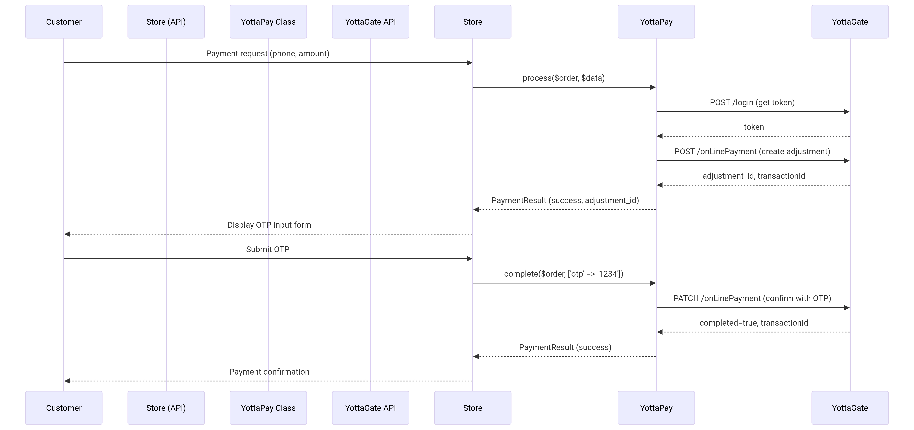

# YottaPay (Sabacash) Payment Gateway Documentation – Developer Guide

## 1. Overview

**YottaPay** (trade name: **Sabacash**) is an electronic payment gateway integrated within the `Nano.Yepayment` package in NanoSoft applications. The gateway relies on the **YottaGate** API and uses a two-step mechanism to complete transactions:

1. **Create Transaction** (Create Adjustment) – Customer data, amount, and terminal are sent.
2. **Confirm Transaction** (Confirm Adjustment) – Using an OTP code sent to the customer via SMS.

This class can be used directly via `Nano\Yepayment\PaymentTypes\YottaPay` or through the unified payment system `Nano\MicroCart\Classes\Payments\PaymentGateway`.

---

## 2. Requirements and Settings

### 2.1. Prerequisites

- NanoSoft (Nano2Soft) system version 2.0+
- Required add-ons:
  - `Nano.MicroCart` (>=2.0)
  - `Nano.Yepayment` (>=1.2)
  - `Nano.Helpers`
- YottaGate login credentials (provided by the gateway operator):
  - `username`
  - `password`
  - `terminal` (default terminal number, e.g., "1")
  - `currencyId` (1: Yemeni Rial, 2: Saudi Riyal, etc.)
  - Base API URL (e.g., `https://api.sabacash.com:49901`)

### 2.2. Gateway Settings in Control Panel

When the **"YottaPay (Sabacash)"** payment method is activated, the following fields appear (stored in the `nano_microcart_payment_gateway_settings` table):

| Field | Key | Description |
|-------|-----|-------------|
| Base API URL | `yottapay_url` | YottaGate API address |
| Username | `yottapay_username` | Merchant username |
| Password | `yottapay_password` | Merchant password (stored encrypted) |
| Default Terminal Number | `yottapay_default_terminal` | Default value (e.g., `"1"`) |
| Default Currency ID | `yottapay_default_currency` | Default value (e.g., `"1"`) |

These settings can be accessed inside the class via:
```php
$url = PaymentGatewaySettings::get('yottapay_url', '');
$username = PaymentGatewaySettings::get('yottapay_username', '');
$terminal = PaymentGatewaySettings::get('yottapay_default_terminal', '1');
```

---

## 3. YottaPay Class – Core Methods

### 3.1. Class Definition

```php
namespace Nano\Yepayment\PaymentTypes;

use Nano\MicroCart\Classes\Payments\PaymentProvider;
use Nano\MicroCart\Classes\Payments\PaymentResult;
use Nano\MicroCart\Models\PaymentGatewaySettings;

class YottaPay extends PaymentProvider
{
    // ...
}
```

### 3.2. Basic Properties

| Property | Type | Description |
|----------|------|-------------|
| `$order` | `Order` | The order object associated with the payment |
| `$data` | `array` | Data received from the user (phone number, amount, etc.) |
| `$success_url` | `string` | (Not used in YottaPay because payment is without redirect) |
| `$cancel_url` | `string` | (Not used) |

### 3.3. Main Methods

#### `public function identifier(): string`
Returns a unique identifier for the payment method (`yottapay`).

#### `public function name(): string`
Returns the display name (`YottaPay`).

#### `public function process(PaymentResult $result): PaymentResult`
Creates a new payment transaction via API.

**Expected input in `$this->data` (from payment form):**
- `source_phone` – Source mobile number (customer)
- `terminal` – Terminal number (optional, uses default if not provided)
- `amount` – Amount
- `currency_id` – Currency ID (optional)
- `note` – Note (optional)

**Actions:**
1. Validate data via `checkValidate()`.
2. Obtain OAuth token via `getAuthToken()`.
3. Send POST request to `/api/accounts/v1/adjustment/onLinePayment`.
4. Save `adjustment.id` in `order->payment_first_trans_id`.
5. Save transaction data in `order->other_data['yottapay']`.
6. Return `PaymentResult` with `successful = true` and a message asking for OTP input.

#### `public function complete(PaymentResult $result): PaymentResult`
Confirms the payment using an OTP code.

**Required input in `$this->data`:**
- `otp` – OTP code received by the customer

**Actions:**
1. Retrieve `adjustmentId` from `order->payment_first_trans_id`.
2. Send PATCH request to `/api/accounts/v1/adjustment/onLinePayment` with `id` and `otp`.
3. If `completed == true`, update order status to paid.
4. Save `transactionId` from response in `order->payment_trans_id`.
5. Return `PaymentResult` with success or failure.

#### `public function getAuthToken(): ?string`
Requests an OAuth token from YottaGate.

**Endpoint:** `POST /api/user-ms/v1/login`  
**Data:** `{"username": "...", "password": "..."}`  
**Returns:** The token string or `null` on failure.

#### `public function checkTransactionStatus($transactionId): array`
Queries the status of a transaction using its Transaction ID.

**Endpoint:** `GET /api/accounts/v1/adjustment/checkAdjustmentByTransactionId?transactionId=...`  
**Returns:** Array containing `success`, `status`, `statusCode`, `amount`, `transactionDate`.

#### `public function changePassword($oldPassword, $newPassword): array`
Changes the merchant account password (used in test tools).

**Endpoint:** `PATCH /api/user-ms/v1/user/changeUserPassword`  
**Data:** `{"oldPassword": "...", "password": "..."}`

---

## 4. Step-by-Step Payment Mechanism (for Developers)

### 4.1. Complete Process Flow



### 4.2. Integrating the Gateway into a Custom API

#### a. Create Payment Transaction (Initiate Payment)

**Custom endpoint in `routes/api.php`:**

```php
Route::post('/payment/yottapay/create', function (Request $request) {
    $order = Order::find($request->order_id);
    $yotta = new YottaPay($order, [
        'source_phone' => $request->source_phone,
        'amount'       => $request->amount,
        'terminal'     => $request->terminal ?? '1',
        'currency_id'  => $request->currency_id ?? '1',
        'note'         => $request->note,
    ]);
    $result = new PaymentResult($yotta, $order);
    $processResult = $yotta->process($result);
    return response()->json([
        'success' => $processResult->successful,
        'adjustment_id' => $order->payment_first_trans_id,
        'message' => $processResult->message,
    ]);
});
```

**Example request:**
```json
POST /api/payment/yottapay/create
{
    "order_id": 200,
    "source_phone": "771234567",
    "amount": 1000,
    "terminal": "1",
    "currency_id": "1",
    "note": "Payment for order #200"
}
```

**Response:**
```json
{
    "success": true,
    "adjustment_id": "816613",
    "message": "Transaction created, please enter the OTP code sent to your mobile"
}
```

#### b. Confirm Payment Using OTP

**Confirmation endpoint:**

```php
Route::post('/payment/yottapay/confirm', function (Request $request) {
    $order = Order::find($request->order_id);
    $yotta = new YottaPay($order, ['otp' => $request->otp]);
    $result = new PaymentResult($yotta, $order);
    $confirmResult = $yotta->complete($result);
    return response()->json([
        'success' => $confirmResult->successful,
        'transaction_id' => $order->payment_trans_id,
        'message' => $confirmResult->message,
    ]);
});
```

**Example request:**
```json
POST /api/payment/yottapay/confirm
{
    "order_id": 200,
    "otp": "4320"
}
```

**Success response:**
```json
{
    "success": true,
    "transaction_id": "DF-01-0123456-0123456789",
    "message": "Payment confirmed successfully"
}
```

#### c. Check Transaction Status

```php
Route::get('/payment/yottapay/status', function (Request $request) {
    $yotta = new YottaPay();
    $status = $yotta->checkTransactionStatus($request->transaction_id);
    return response()->json($status);
});
```

**Request:**
```
GET /api/payment/yottapay/status?transaction_id=DF-01-0123456-0123456789
```

**Response:**
```json
{
    "success": true,
    "status": "completed",
    "statusCode": "completed",
    "amount": "1000.000000",
    "transactionDate": "1655714348044"
}
```

---

## 5. Built-in Test Endpoints in `routes.php`

Within the `routes.php` file of `Nano.Yepayment`, a set of helper endpoints is provided under the group `/api/v1/yepayment`, intended for developers and administrators to test the gateway.

### 5.1. List of Endpoints

| Path | Method | Description |
|------|--------|-------------|
| `/yottapay/test-auth` | POST | Test authentication with YottaGate (get token) |
| `/yottapay/test-create-payment` | POST | Create a test transaction (mimics `process`) |
| `/yottapay/test-confirm-payment` | POST | Confirm a transaction using a test OTP |
| `/yottapay/test-check-status` | GET | Check transaction status using `transaction_id` |
| `/yottapay/test-full-payment` | POST | Full test (create + confirm + query) |
| `/yottapay/test-change-password` | POST | Test password change |
| `/yottapay/stats` | GET | Gateway usage statistics (order count, success rate) |
| `/yottapay/test-ui` | GET | Interactive web interface for testing all functions |

### 5.2. Explanation of Each Endpoint

#### `POST /yottapay/test-auth`
No input data required (uses stored settings).  
**Response:** `{ success, token, token_length }`

#### `POST /yottapay/test-create-payment`
**Request data (JSON):**
```json
{
    "order_id": 200,
    "source_phone": "771234567",
    "terminal": "1",
    "amount": 1000,
    "currency_id": "1",
    "note": "test"
}
```
**Response:** `{ success, adjustment_id, transaction_id, order_data }`

#### `POST /yottapay/test-confirm-payment`
**Request data:**
```json
{
    "order_id": 200,
    "adjustment_id": "816613",
    "otp": "4320",
    "note": "confirm"
}
```
**Response:** `{ success, transaction_id, completed }`

#### `GET /yottapay/test-check-status?transaction_id=...`
**Response:** `{ success, status, statusCode, amount, transactionDate }`

#### `POST /yottapay/test-full-payment`
Executes the three steps automatically (create, confirm with test OTP `1234`, query).  
**Response:** Contains `results` (results of each step) and `summary`.

#### `GET /yottapay/test-ui`
Displays a complete HTML interface containing:
- Step-by-step manual testing
- Automated test with configurable iteration count
- Instant statistics
- Test logs stored in LocalStorage
- Additional tools (change password, connection test, export logs)

#### `GET /yottapay/stats`
**Response:** Statistics such as `total_orders`, `yottapay_orders`, `successful_payments`, `success_rate`, gateway settings.

---

## 6. Using the Gateway via an External API (for other applications)

If you are developing an external application (e.g., a mobile app or independent e-commerce store) and wish to integrate YottaPay without using the `YottaPay` class directly, you can call the **public endpoints** provided by the system (listed above) after authenticating via `oauth-users`.

### 6.1. Pre-authentication

You must have a valid OAuth 2.0 token (can be obtained from the NanoSoft system via the usual login endpoint). Then send the token in the header:
```
Authorization: Bearer <token>
```

### 6.2. Complete Example Using cURL

#### a. Create Transaction
```bash
curl -X POST "https://yourdomain.com/api/v1/yepayment/yottapay/test-create-payment" \
  -H "Authorization: Bearer <token>" \
  -H "Content-Type: application/json" \
  -d '{
    "order_id": 200,
    "source_phone": "771234567",
    "amount": 1000,
    "terminal": "1",
    "currency_id": "1",
    "note": "Product purchase"
  }'
```

#### b. Confirm Payment
```bash
curl -X POST "https://yourdomain.com/api/v1/yepayment/yottapay/test-confirm-payment" \
  -H "Authorization: Bearer <token>" \
  -H "Content-Type: application/json" \
  -d '{
    "order_id": 200,
    "adjustment_id": "816613",
    "otp": "4320"
  }'
```

#### c. Check Status
```bash
curl -X GET "https://yourdomain.com/api/v1/yepayment/yottapay/test-check-status?transaction_id=DF-01-..." \
  -H "Authorization: Bearer <token>"
```

> **Note:** These endpoints are also protected by `BackendAuth` (require the user to be an administrator). If you want to expose them to regular customers, you must modify `routes.php` to remove the `BackendAuth` check or add custom middleware.

---

## 7. Common Error Codes and Solutions

| HTTP Code | Error (from YottaGate) | Cause and Solution |
|-----------|------------------------|---------------------|
| 401 | Unauthorized | Authentication failed – check `username`/`password` in settings. |
| 400 | entity of mobile [xxx] is not exists | Phone number not registered in YottaGate – verify the number. |
| 400 | Sender do not has sufficient balance | Source (customer) balance insufficient. |
| 400 | can not do transaction, you Already did transaction | Transaction already confirmed – do not attempt to confirm again. |
| 400 | Operation expired, this Operation Timed out | Transaction expired – create a new transaction. |
| 400 | anonymous users can not perform any transaction | Token invalid or expired – request a new token. |
| 404 | Entered id [xxx] does not exist | `adjustment_id` not found – check `payment_first_trans_id`. |

---

## 8. Practical Examples of Using the Class in Custom Code

### 8.1. Create Transaction Without Using `PaymentGateway`

```php
use Nano\Yepayment\PaymentTypes\YottaPay;
use Nano\Orders\Models\Order;

$order = Order::find(200);
$yotta = new YottaPay($order, [
    'source_phone' => '771234567',
    'amount'       => 1000,
    'terminal'     => '1',
    'currency_id'  => '1',
    'note'         => 'Payment for order #200',
]);

$paymentResult = new \Nano\MicroCart\Classes\Payments\PaymentResult($yotta, $order);
$processResult = $yotta->process($paymentResult);

if ($processResult->successful) {
    $adjustmentId = $order->payment_first_trans_id;
    // Store adjustmentId in session or send to client
}
```

### 8.2. Confirm Payment

```php
$yotta = new YottaPay($order, ['otp' => '4320']);
$confirmResult = $yotta->complete($paymentResult);
if ($confirmResult->successful) {
    // Payment succeeded
}
```

### 8.3. Use the Change Password Function

```php
$yotta = new YottaPay();
$result = $yotta->changePassword('old123', 'new456');
if ($result['success']) {
    echo "Password changed successfully";
}
```

---

## 9. Summary of Endpoints in `routes.php` (Quick Reference)

| Full Path | Method | Usage |
|-----------|--------|-------|
| `/api/v1/yepayment/yottapay/test-auth` | POST | Test login credentials |
| `/api/v1/yepayment/yottapay/test-create-payment` | POST | Create a test transaction |
| `/api/v1/yepayment/yottapay/test-confirm-payment` | POST | Confirm a transaction with OTP |
| `/api/v1/yepayment/yottapay/test-check-status` | GET | Query transaction status |
| `/api/v1/yepayment/yottapay/test-full-payment` | POST | Full test (create + confirm + query) |
| `/api/v1/yepayment/yottapay/test-change-password` | POST | Change merchant account password |
| `/api/v1/yepayment/yottapay/test-ui` | GET | Web test interface |
| `/api/v1/yepayment/yottapay/stats` | GET | Gateway statistics |

> **Note:** All these endpoints require the current user to be an administrator (`BackendAuth`). To make them available to regular API clients, modify `routes.php` or add custom middleware.

---

## 10. References

- [YottaPay Class](./YottaPay.php) – Full gateway code.
- [routes.php file](./routes.php) – Definition of YottaPay endpoints.
- [Postman Collection (Sabacash)](./Sabacash%20online%20payment.postman_collection.json)
- [API Online Payments v1.3](./API%20Online%20Payments%20v%201.3.pdf)
- [API Online Payment Return v1.4](./API%20Online%20Payment%20Return%20v%201.4.pdf)
- [API Online Status Check v1.3](./API%20Online%20Status%20Check%20v1.3.pdf)
- [YottaPay Login & Change Password](./yottaPay%20Login%20-%20Change%20My%20Password%20API%20Documentation%20V.1.1.pdf)

---

**This documentation is prepared to help developers integrate and use the YottaPay (Sabacash) gateway easily and efficiently.**  
For inquiries or technical support, please contact via the official website [nano2soft.com](https://nano2soft.com).


---
